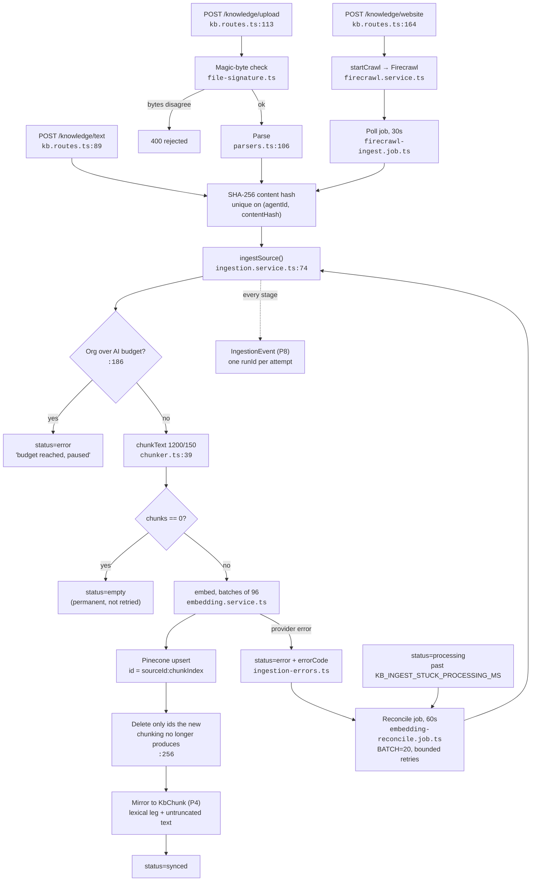
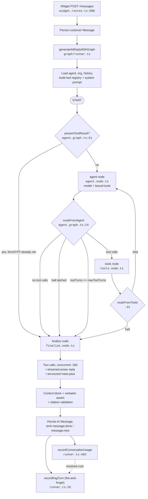
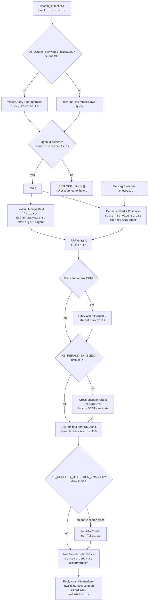
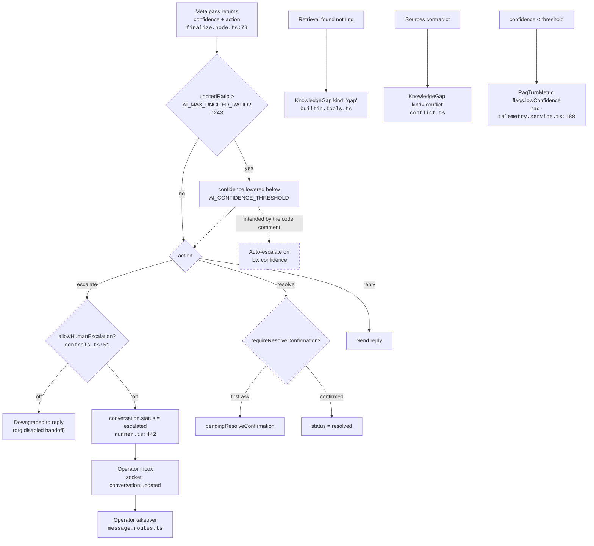
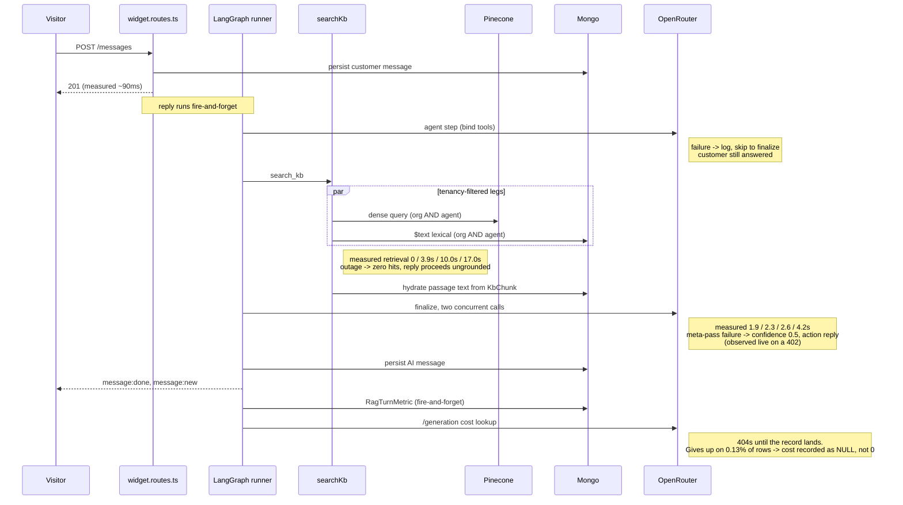

# End-to-End RAG Flow

How a visitor's message becomes a knowledge-grounded answer, as the code stands
today. Knowledge is keyed by **(organizationId, agentId)**: each agent maps to one
website and only ever sees its own knowledge base.

---

## 1. Ingestion

Entry `kb.routes.ts:89` (text), `:113` (upload), `:164` (website).
Pipeline `ingestion.service.ts:74`. Crawl completion `firecrawl.service.ts:85`.

**Ticks cannot overlap.** All four background loops are wrapped in `serialLoop`
(`jobs/serial-loop.ts`), which drops a tick whose predecessor is still running.
This matters because none of these jobs claim their work atomically: the
reconcile pass selects up to 20 sources by `embeddingStatus`, and that status
does not change until the ingest finishes. Before the latch, one source slower
than the 60s interval was enough for two ticks to select the *same* sources and
embed them twice, which is a duplicated provider bill rather than a race that
settles itself. Skipping is safe because each loop is a sweep, not a queue
consumer: whatever it passes over is still there next tick. Skips and overruns
are logged (`[jobs] tick skipped`, `[jobs] tick overran its interval`), because a
loop that never keeps up otherwise looks identical to one with nothing to do.

**`embeddingStatus` transitions:** `pending → processing → {synced | empty | error}`,
plus `deleting`. `empty` is deliberately its own state and is **not** retried: a
scanned PDF with no text layer produces a scanned PDF with no text layer.

## 2. Customer message flow

Entry `widget.routes.ts:888` → `generateAiReply` (re-exported from
`services/ai/index.ts`; the implementation is `graph/runner.ts`). Fire-and-forget,
so the POST returns in ~90ms while the turn runs on.

**The `halt` latch** is set by a tool that hands control to the customer (an
inline form or an OTP challenge). It latches on: once something awaits the
visitor, no further tool may run this turn, or the model would claim an action
that has not happened.

**The ceiling** is `AI_MAX_TOOL_TURNS` (default 10), checked at
`agent.graph.ts:30`. Each agent↔tool round trip costs two graph steps, and the
runner sets `recursionLimit = maxToolTurns * 2 + 10`.

**Who may drive a turn.** Every conversation-scoped socket event carries a
client-supplied `conversationId`, and that id is attacker-controlled. One rule
decides them all, in `socket/authorize.ts`: an operator may act on any
conversation in their own organization, a contact only on conversations
belonging to their own session. The handshake middleware (`socket/auth.ts`)
establishes *who* a socket is and cannot vet the ids that follow, so the check
has to live here.

This is per-conversation, not per-tenant, because same tenant is not the same
person: two visitors on one customer's website share an `organizationId`. An
org-only check let one of them post into the other's chat through `message:send`
(writing a message attributed to that visitor *and* triggering a billable AI
reply on their thread) and put a false typing indicator on it. Decisions are
memoized per socket, since `customer:typing` fires on every keystroke. The
legacy `typing:start` / `typing:stop` relays require the sender to have joined
the room, because `socket.to(room)` broadcasts whether or not the sender is a
member. Covered by `socket-room-auth.test.ts` and `socket-message-auth.test.ts`.

## 3. Retrieval, expanded

`understoodSearch()` (`understood-search.ts:50`) when P3/P5/P7 flags are on;
`searchKb()` (`search.service.ts:34`) always. **Every leg is tenancy-filtered.**

`NS` is dashed: `__specs/12` once claimed per-org namespaces as a critical
control. They are not implemented; isolation is the AND-ed metadata filter plus
the refusal above. See `__specs/04` "Vector-store tenancy".

## 4. Escalation and handoff

> **`AUTOESC` is dashed: low confidence does not escalate.** Nothing in
> `controls.ts` or `runner.ts` routes on confidence. The only escalation is the
> model choosing `action: "escalate"`, plus the runner's fallback when the graph
> produces nothing (`runner.ts:137`). The P6 uncited-ratio path is therefore a
> *signal*, not a control: it sets `flags.lowConfidence`
> (`rag-telemetry.service.ts:188`) and surfaces on the RAG Quality dashboard and
> in the alert sweep, and changes nothing about the turn the customer sees.
>
> The code used to claim otherwise. Comments in `finalize.node.ts` and
> `config/env.ts` both said the drop let "the EXISTING `AI_CONFIDENCE_THRESHOLD`
> escalation" catch the turn, and both have been corrected to describe what the
> code does. The *behaviour* is unchanged and deliberately so: routing low
> confidence to a human is a product decision, not a comment fix. It stays open
> as A20 in `__specs/45-deferred-decisions.md`, and the generation-stage note in
> `__specs/37-rag-pipeline-audit.md` describes the same thing.

## 5. One turn, with measured latency

Measured from **4** `RagTurnMetric` rows in the development database. Four
samples is a range, not a distribution: the p50 is a midpoint and there is **no
meaningful p95**. Cost is from 1,516 `UsageRecord` rows and is a real sample.

**Turn wall time, all four samples:** 7.9s, 10.9s, 21.3s, 31.5s.
**Cost per answered turn:** $0.0158 (=$0.9978 over 63 turns).

---

## Config

Per-agent `model` / `temperature` override the env defaults at call time
(`runner.ts`). `AI_CONFIDENCE_THRESHOLD` is **telemetry and dashboard only** —
see the note under diagram 4. Pinecone upserts batch at 100 and deletes at 1000
(`config/pinecone.ts:101-102`).

## Related

- [`__specs/37-rag-pipeline-audit.md`](__specs/37-rag-pipeline-audit.md) — stage audit, failure modes, measured numbers
- [`__specs/38-scale-and-load-risks.md`](__specs/38-scale-and-load-risks.md) — what breaks under load
- [`__specs/05-ai-agent-design.md`](__specs/05-ai-agent-design.md) — graph design and ReAct conformance
- [`__specs/04-pinecone-firecrawl.md`](__specs/04-pinecone-firecrawl.md) — vector store, crawl, index health
- [`__specs/39-rag-evaluation.md`](__specs/39-rag-evaluation.md) — offline harness and online telemetry
