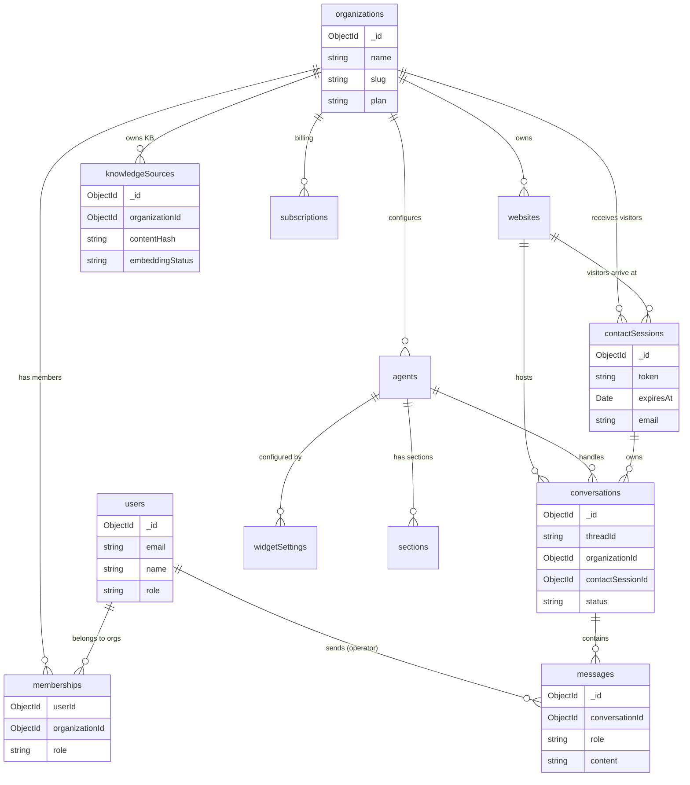

# 03 — Data Model (MongoDB)

## Overview

All collections enforce **`organizationId`** scoping. Every query from authenticated context must include `organizationId` — there is no global data access except for platform admin operations.

---

## Collections

### 1. `organizations`

| Field | Type | Required | Description |
|-------|------|----------|-------------|
| `_id` | `ObjectId` | auto | Primary key |
| `name` | `string` | ✅ | Organization display name |
| `slug` | `string` | ✅ | URL-friendly unique slug |
| `plan` | `string` | ✅ | `free` / `starter` / `pro` / `enterprise` |
| `paddleCustomerId` | `string` | — | Paddle customer ID |
| `paddleSubscriptionId` | `string` | — | Active subscription ID |
| `settings` | `object` | — | Org-level settings (timezone, language) |
| `createdAt` | `Date` | auto | |
| `updatedAt` | `Date` | auto | |

**Indexes:**
- `{ slug: 1 }` — unique
- `{ paddleCustomerId: 1 }` — unique, sparse

---

### 2. `users`

| Field | Type | Required | Description |
|-------|------|----------|-------------|
| `_id` | `ObjectId` | auto | Primary key |
| `email` | `string` | ✅ | Unique across platform |
| `passwordHash` | `string` | — | bcrypt hash (null for OAuth-only users) |
| `phone` | `string` | ✅ | phone |
| `avatarUrl` | `string` | — | Profile image URL |
| `provider` | `string` | ✅ | `credentials` / `google` |
| `providerId` | `string` | — | Google sub ID (for OAuth) |
| `role` | `string` | ✅ | `user` / `platform_admin` |
| `emailVerifiedAt` | `Date` | — | Email verification timestamp |
| `lastLoginAt` | `Date` | — | |
| `createdAt` | `Date` | auto | |
| `updatedAt` | `Date` | auto | |

**Indexes:**
- `{ email: 1 }` — unique
- `{ provider: 1, providerId: 1 }` — unique, sparse

---

### 3. `memberships`

Links users to organizations with role-based access.

| Field | Type | Required | Description |
|-------|------|----------|-------------|
| `_id` | `ObjectId` | auto | Primary key |
| `userId` | `ObjectId` | ✅ | Ref → `users` |
| `organizationId` | `ObjectId` | ✅ | Ref → `organizations` |
| `role` | `string` | ✅ | `owner` / `admin` / `agent` / `viewer` |
| `invitedBy` | `ObjectId` | — | Ref → `users` |
| `invitedAt` | `Date` | — | |
| `acceptedAt` | `Date` | — | |
| `status` | `string` | ✅ | `active` / `pending` / `revoked` |
| `createdAt` | `Date` | auto | |
| `updatedAt` | `Date` | auto | |

**Indexes:**
- `{ userId: 1, organizationId: 1 }` — unique (one membership per user-org pair)
- `{ organizationId: 1, role: 1 }` — for listing org members by role
- `{ userId: 1, status: 1 }` — for user's active orgs

---

### 4. `websites`

| Field | Type | Required | Description |
|-------|------|----------|-------------|
| `_id` | `ObjectId` | auto | Primary key |
| `organizationId` | `ObjectId` | ✅ | Ref → `organizations` |
| `name` | `string` | ✅ | Display name (e.g., "Main Website") |
| `domain` | `string` | ✅ | `example.com` |
| `allowedOrigins` | `string[]` | ✅ | CORS origins for widget embed |
| `isActive` | `boolean` | ✅ | Whether widget is enabled |
| `createdAt` | `Date` | auto | |
| `updatedAt` | `Date` | auto | |

**Indexes:**
- `{ organizationId: 1 }` — list websites per org
- `{ organizationId: 1, domain: 1 }` — unique per org

---

### 5. `agents`

The agent record stores **configuration and branding per website** — one agent
per website (unique index on `websiteId`). Each website's agent has its own
persona + model config; unset model-tuning fields fall back to env defaults.

| Field | Type | Required | Description |
|-------|------|----------|-------------|
| `_id` | `ObjectId` | auto | Primary key |
| `organizationId` | `ObjectId` | ✅ | Ref → `organizations` |
| `websiteId` | `ObjectId` | ✅ | Ref → `websites` — **one agent per website** (unique). Created automatically when a website is created; the widget resolves the agent for the conversation's website. |
| `name` | `string` | ✅ | Agent display name (shown in widget) |
| `description` | `string` | — | Short description |
| `avatarUrl` | `string` | — | Agent avatar for widget |
| `welcomeMessage` | `string` | — | First automatic greeting |
| `suggestedQuestions` | `string[]` | — | Pre-chat suggestions |
| `systemPromptOverride` | `string` | — | Org-specific system prompt additions (appended to base) |
| `model` | `string` | — | LLM model override (default from env) |
| `temperature` | `number` | — | Model temperature (default 0.7) |
| `confidenceThreshold` | `number` | — | Minimum AI confidence score (0.0–1.0). Responses below this auto-escalate to human. Default: `0.7`. |
| `isActive` | `boolean` | ✅ | Whether agent is active |
| `createdAt` | `Date` | auto | |
| `updatedAt` | `Date` | auto | |

**Indexes:**
- `{ organizationId: 1 }` — list agents per org

---

### 6. `contactSessions`

> ⚠️ **Critical**: Email is NOT a unique index for conversation lookup. Identity is `contactSessionId` + session token only.

| Field | Type | Required | Description |
|-------|------|----------|-------------|
| `_id` | `ObjectId` | auto | Primary key (= `contactSessionId`) |
| `organizationId` | `ObjectId` | ✅ | Ref → `organizations` |
| `websiteId` | `ObjectId` | ✅ | Ref → `websites` |
| `token` | `string` | ✅ | Opaque session token (UUID v4, stored in localStorage) |
| `email` | `string` | — | Contact email (CRM purposes only) |
| `phone` | `string` | — | Contact phone (CRM purposes only) |
| `name` | `string` | — | Contact name |
| `metadata` | `object` | — | Custom data from embed (e.g., `data-user-id`) |
| `ipAddress` | `string` | — | First-seen IP |
| `userAgent` | `string` | — | Browser UA string |
| `expiresAt` | `Date` | ✅ | Session expiration (24h from creation) |
| `lastActiveAt` | `Date` | ✅ | Last activity timestamp |
| `createdAt` | `Date` | auto | |
| `updatedAt` | `Date` | auto | |

**Indexes:**
- `{ token: 1 }` — unique, for session lookup
- `{ organizationId: 1, websiteId: 1 }` — list sessions per org/site
- `{ expiresAt: 1 }` — **TTL index** (MongoDB auto-deletes expired docs)
- `{ organizationId: 1, email: 1 }` — for CRM search (NOT for conversation lookup)

**Session TTL rules:**
- **Fixed window**: 24 hours from creation (simplest to implement)
- **Sliding window** (recommended): refresh `expiresAt` to `now + 24h` on every activity
- On expiry: localStorage token becomes invalid → widget creates new session → fresh conversation
- TTL index handles cleanup: `{ expiresAt: 1, expireAfterSeconds: 0 }`

---

### 7. `conversations`

| Field | Type | Required | Description |
|-------|------|----------|-------------|
| `_id` | `ObjectId` | auto | Primary key |
| `threadId` | `string` | ✅ | Unique thread identifier (UUID v4) |
| `organizationId` | `ObjectId` | ✅ | Ref → `organizations` |
| `websiteId` | `ObjectId` | ✅ | Ref → `websites` |
| `agentId` | `ObjectId` | ✅ | Ref → `agents` |
| `contactSessionId` | `ObjectId` | ✅ | Ref → `contactSessions` |
| `status` | `string` | ✅ | `active` / `escalated` / `resolved` / `expired` |
| `assignedOperatorId` | `ObjectId` | — | Ref → `users` (assigned on escalation) |
| `subject` | `string` | — | Auto-generated from first message |
| `lastMessageAt` | `Date` | — | For inbox sorting |
| `lastMessagePreview` | `string` | — | Truncated last message text |
| `messageCount` | `number` | — | Total messages in thread |
| `resolvedAt` | `Date` | — | When conversation was resolved |
| `resolvedBy` | `string` | — | `ai` / `operator` / `system` |
| `escalatedAt` | `Date` | — | When escalated to human |
| `metadata` | `object` | — | Tags, priority, custom fields |
| `createdAt` | `Date` | auto | |
| `updatedAt` | `Date` | auto | |

**Indexes:**
- `{ threadId: 1 }` — unique
- `{ organizationId: 1, status: 1, lastMessageAt: -1 }` — inbox listing (sorted by recent)
- `{ organizationId: 1, websiteId: 1, status: 1 }` — filtered by website
- `{ contactSessionId: 1 }` — find conversations for a session
- `{ organizationId: 1, assignedOperatorId: 1 }` — operator's assigned conversations

**Status transitions:**
```
active → escalated (AI tool or operator action)
active → resolved (AI tool or operator action)
escalated → resolved (operator action)
escalated → active (operator reopens)
```

**Resolved conversation behavior:**
- AI auto-reply **stops** when `status = resolved`
- Widget shows "Conversation resolved" state with option to start new conversation
- If customer sends new message on resolved conversation → status flips back to `active` → AI resumes

---

### 8. `messages`

| Field | Type | Required | Description |
|-------|------|----------|-------------|
| `_id` | `ObjectId` | auto | Primary key |
| `conversationId` | `ObjectId` | ✅ | Ref → `conversations` |
| `organizationId` | `ObjectId` | ✅ | Denormalized for RLS queries |
| `role` | `string` | ✅ | `customer` / `ai` / `operator` / `system` |
| `content` | `string` | ✅ | Message text (Markdown supported) |
| `senderId` | `ObjectId` | — | Ref → `users` (for operator) or `contactSessions` (for customer) |
| `senderType` | `string` | ✅ | `contact` / `user` / `ai` / `system` |
| `attachments` | `array` | — | `[{ fileName, fileUrl, mimeType, size }]` |
| `toolCalls` | `array` | — | `[{ name, args, result }]` (for AI tool use) |
| `confidence` | `number` | — | AI self-assessed confidence score (0.0–1.0). Only present when `role = 'ai'`. Used for monitoring and auto-escalation. |
| `isEnhanced` | `boolean` | — | Whether message was AI-enhanced (operator messages) |
| `originalContent` | `string` | — | Pre-enhancement text (if enhanced) |
| `readByOperator` | `boolean` | — | Read receipt for inbox |
| `createdAt` | `Date` | auto | |

**Indexes:**
- `{ conversationId: 1, createdAt: 1 }` — thread messages in order
- `{ organizationId: 1, createdAt: -1 }` — global search
- `{ conversationId: 1, role: 1 }` — filter by sender type

---

### 9. `knowledgeSources`

| Field | Type | Required | Description |
|-------|------|----------|-------------|
| `_id` | `ObjectId` | auto | Primary key |
| `organizationId` | `ObjectId` | ✅ | Ref → `organizations` |
| `agentId` | `ObjectId` | ✅ | Ref → `agents` — **knowledge is keyed by (organizationId, agentId)**; the widget agent searches only `conversation.agentId`'s KB. Unique index `{ agentId, contentHash }`. (Each agent maps to one website.) |
| `type` | `string` | ✅ | `text` / `pdf` / `docx` / `excel` / `csv` / `image` / `html` / `website` |
| `title` | `string` | ✅ | Display name |
| `content` | `string` | — | Raw extracted text (for text type) |
| `fileUrl` | `string` | — | Object storage URL (for uploaded files) |
| `fileName` | `string` | — | Original filename |
| `mimeType` | `string` | — | File MIME type |
| `fileSize` | `number` | — | File size in bytes |
| `sourceUrl` | `string` | — | Original URL (for website/HTML type) |
| `contentHash` | `string` | ✅ | SHA-256 of normalized extracted text |
| `extractedText` | `string` | — | Full extracted text (post-processing) |
| `chunkCount` | `number` | — | Number of chunks created |
| `pineconeIds` | `string[]` | — | Vector IDs in Pinecone (for cleanup on delete) |
| `embeddingStatus` | `string` | ✅ | `pending` / `processing` / `synced` / `error` / `deleting` |
| `embeddingError` | `string` | — | Last error message if embedding failed |
| `lastSyncedAt` | `Date` | — | Last successful Pinecone sync |
| `retryCount` | `number` | — | Number of embedding retry attempts |
| `version` | `number` | ✅ | Document version (incremented on update) |
| `createdBy` | `ObjectId` | ✅ | Ref → `users` |
| `updatedBy` | `ObjectId` | — | Ref → `users` |
| `createdAt` | `Date` | auto | |
| `updatedAt` | `Date` | auto | |

**Indexes:**
- `{ organizationId: 1, contentHash: 1 }` — unique (dedup per org)
- `{ organizationId: 1, type: 1 }` — filter by type
- `{ organizationId: 1, embeddingStatus: 1 }` — find pending/error for retry
- `{ embeddingStatus: 1, retryCount: 1 }` — reconciliation job query

**Content hash dedup flow:**
1. On create/upload: extract text → normalize (lowercase, trim, collapse whitespace) → SHA-256
2. Query: `KnowledgeSource.findOne({ agentId, contentHash })` (dedup is per-agent)
3. If exists → reject with `409 Conflict` and message: "Duplicate content already exists"
4. If updating file → new hash → new version (increment `version`, replace Pinecone vectors)

---

### 10. `widgetSettings`

| Field | Type | Required | Description |
|-------|------|----------|-------------|
| `_id` | `ObjectId` | auto | Primary key |
| `organizationId` | `ObjectId` | ✅ | Ref → `organizations` |
| `agentId` | `ObjectId` | ✅ | Ref → `agents` |
| `title` | `string` | — | Widget header title |
| `subtitle` | `string` | — | Subtitle text |
| `welcomeMessage` | `string` | — | Greeting message |
| `suggestedQuestions` | `string[]` | — | Pre-chat suggestions |
| `primaryColor` | `string` | — | Brand color (hex) |
| `position` | `string` | — | `bottom-right` / `bottom-left` / `centered` |
| `theme` | `string` | `light` | `light` / `dark` / `auto` (auto follows prefers-color-scheme) |
| `showBranding` | `boolean` | `true` | Show "Powered by" footer in the widget |
| `avatarUrl` | `string` | — | Widget avatar (overrides the agent's avatar) |
| `offlineMessage` | `string` | — | Message when no operators online (persisted; not yet surfaced by the widget) |
| `requireContactBeforeChat` | `boolean` | — | If true, the pre-chat screen blocks the first message until a valid email is given (default: false) |
| `createdAt` | `Date` | auto | |
| `updatedAt` | `Date` | auto | |

**Indexes:**
- `{ organizationId: 1, agentId: 1 }` — unique

---

### 11. `subscriptions`

| Field | Type | Required | Description |
|-------|------|----------|-------------|
| `_id` | `ObjectId` | auto | Primary key |
| `organizationId` | `ObjectId` | ✅ | Ref → `organizations` |
| `paddleSubscriptionId` | `string` | ✅ | Paddle subscription ID |
| `paddleCustomerId` | `string` | ✅ | Paddle customer ID |
| `plan` | `string` | ✅ | `starter` / `pro` / `enterprise` |
| `status` | `string` | ✅ | `active` / `trialing` / `past_due` / `canceled` / `paused` |
| `currentPeriodStart` | `Date` | ✅ | |
| `currentPeriodEnd` | `Date` | ✅ | |
| `canceledAt` | `Date` | — | |
| `trialEndAt` | `Date` | — | |
| `paddleData` | `object` | — | Raw Paddle webhook data (for debugging) |
| `createdAt` | `Date` | auto | |
| `updatedAt` | `Date` | auto | |

**Indexes:**
- `{ organizationId: 1 }` — unique (one subscription per org)
- `{ paddleSubscriptionId: 1 }` — unique
- `{ status: 1 }` — filter active subscriptions

---

### 12. `sections`

Widget navigation sections (quick links/topics).

| Field | Type | Required | Description |
|-------|------|----------|-------------|
| `_id` | `ObjectId` | auto | Primary key |
| `organizationId` | `ObjectId` | ✅ | Ref → `organizations` |
| `agentId` | `ObjectId` | ✅ | Ref → `agents` |
| `title` | `string` | ✅ | Section title |
| `description` | `string` | — | Short description |
| `icon` | `string` | — | Icon name or emoji |
| `url` | `string` | — | Optional external link |
| `action` | `string` | — | `link` / `start-chat` / `topic` |
| `topicPrompt` | `string` | — | Pre-fill message if action = `topic` |
| `order` | `number` | ✅ | Sort order |
| `isActive` | `boolean` | ✅ | |
| `createdAt` | `Date` | auto | |
| `updatedAt` | `Date` | auto | |

**Indexes:**
- `{ organizationId: 1, agentId: 1, order: 1 }` — sorted sections per agent

---

### 13. `usagerecords`

Per-turn LLM cost records (one doc per `generateAiReply` invocation).

| Field | Type | Required | Description |
|-------|------|----------|-------------|
| `_id` | `ObjectId` | auto | Primary key |
| `organizationId` | `ObjectId` | ✅ | Ref → `organizations` |
| `websiteId` | `ObjectId` | — | Ref → `websites` |
| `conversationId` | `ObjectId` | — | Ref → `conversations` |
| `generationIds` | `string[]` | — | OpenRouter generation IDs for cost lookup |
| `model` | `string` | — | Model name (e.g. `openai/gpt-4o`) |
| `promptTokens` | `number` | — | Aggregated prompt tokens |
| `completionTokens` | `number` | — | Aggregated completion tokens |
| `totalTokens` | `number` | — | `promptTokens + completionTokens` |
| `costUsd` | `number` | — | Actual USD cost from OpenRouter |
| `period` | `string` | ✅ | `YYYY-MM` (pre-computed for fast monthly grouping) |
| `createdAt` | `Date` | auto | TTL: auto-delete after 2 years |

**Indexes:**
- `{ organizationId: 1, period: 1 }` — monthly org spend queries
- `{ websiteId: 1, period: 1 }` — monthly website spend queries
- `{ createdAt: 1 }` — TTL index (730 days)

---

### 14. `budgetalerts`

Deduplication guard — ensures each budget threshold email is sent at most once per entity × period × threshold.

| Field | Type | Required | Description |
|-------|------|----------|-------------|
| `_id` | `ObjectId` | auto | Primary key |
| `entityType` | `string` | ✅ | `org` or `website` |
| `entityId` | `ObjectId` | ✅ | Org or website ID |
| `period` | `string` | ✅ | `YYYY-MM` |
| `threshold` | `number` | ✅ | `75` or `100` |
| `sentAt` | `Date` | auto | TTL: auto-delete after 90 days |

**Indexes:**
- `{ entityId: 1, period: 1, threshold: 1 }` — unique (prevents duplicate sends)
- `{ sentAt: 1 }` — TTL index (90 days)

---

## Entity Relationship Diagram



---

## RLS Enforcement Pattern

Every Mongoose query in the application MUST include `organizationId` from the authenticated context. Example middleware pattern:

```typescript
// middleware/org-context.middleware.ts
const orgContext = (req, res, next) => {
  const orgId = req.user.organizationId; // from JWT
  if (!orgId) return res.status(403).json({ error: 'No org context' });
  
  // Attach to request for all downstream queries
  req.orgId = orgId;
  next();
};

// In any service/controller:
const conversations = await Conversation.find({
  organizationId: req.orgId,  // ALWAYS include
  status: 'active'
}).sort({ lastMessageAt: -1 });
```

> ⚠️ Never accept `organizationId` from the request body without verifying the user is a member of that organization via the `memberships` collection.
