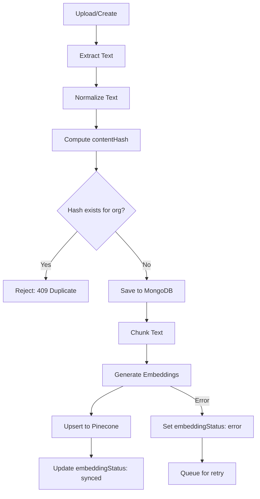
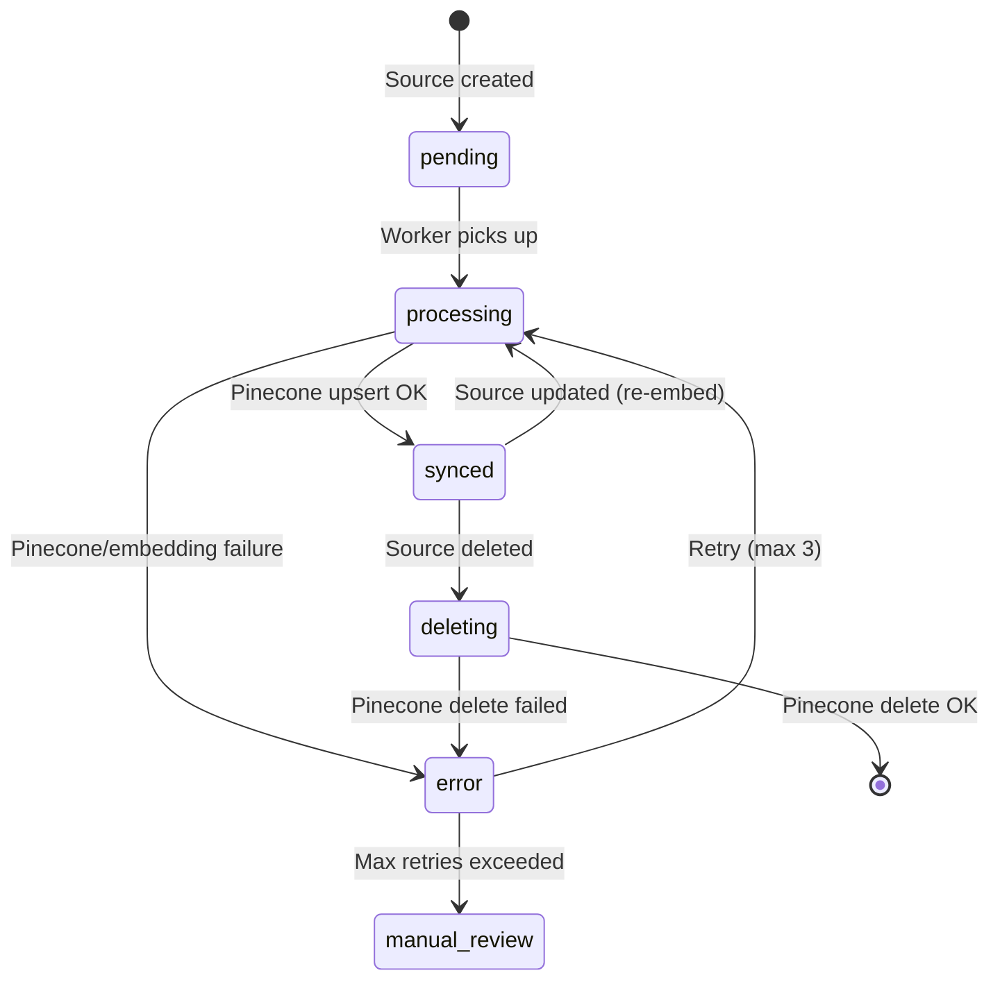

# 04 — Pinecone & Firecrawl Design

## Overview

Pinecone serves as the vector database for organization-scoped knowledge base (KB) retrieval-augmented generation (RAG). Firecrawl handles website URL ingestion. All operations are strictly namespace-isolated by `organizationId`.

---

## Pinecone Architecture

### Index Configuration

| Setting | Value | Rationale |
|---------|-------|-----------|
| Index name | `customer-service-kb` | Single index for all orgs |
| Dimensions | `1536` (OpenAI `text-embedding-3-small`) or `3072` (text-embedding-3-large) | Match embedding model |
| Metric | `cosine` | Standard for semantic search |
| Cloud/Region | AWS `us-east-1` (or nearest) | Low latency |
| Pod type | Serverless (recommended) | Cost-effective for multi-tenant |

### Namespace Strategy

```
Namespace = organizationId.toString()
```

- Each organization's KB vectors live in their own Pinecone namespace
- **No cross-namespace queries are ever possible** — this is Pinecone's isolation model
- Creating/deleting an org namespace is implicit (Pinecone creates on first upsert)

### Vector Metadata Schema

Each vector in Pinecone stores the following metadata:

```typescript
interface PineconeMetadata {
  organizationId: string;     // Redundant with namespace, but useful for logging
  sourceId: string;           // Ref → knowledgeSources._id
  sourceType: string;         // 'text' | 'pdf' | 'docx' | 'website' | etc.
  chunkIndex: number;         // Position within document (0-based)
  totalChunks: number;        // Total chunks in source document
  title: string;              // Source document title (for display)
  text: string;               // FULL chunk text (NOT a preview) — search returns
                              //   this to the agent, so truncating it drops
                              //   retrievable content. Capped only to stay under
                              //   Pinecone's ~40KB/vector metadata limit.
  createdAt: string;          // ISO timestamp
}
```

> **Re-ingest must purge stale vectors.** After upserting the new chunk set,
> delete any previous `pineconeIds` not in the new set (upsert-then-delete).
> Otherwise a re-ingest that yields fewer chunks orphans the old high-index
> vectors. (`ingestSource` does this; the `/knowledge/:id/reingest` route relies on it.)

### Vector ID Convention

```
{sourceId}_{chunkIndex}
```

Example: `665a1b2c3d4e5f001a2b3c4d_0`, `665a1b2c3d4e5f001a2b3c4d_1`, etc.

This convention enables:
- Easy bulk deletion: delete all vectors where ID starts with `sourceId`
- No ID collisions across sources

---

## Ingestion Pipeline (by source type)

### Common Pipeline Steps



### Per-Type Processing

#### 1. Plain Text
```
Input: raw text string
Extract: use as-is
Normalize: trim, collapse whitespace
Chunk: split by paragraphs → fixed-size windows (~300 tokens / 1200 chars, ~150 char overlap — finer than the original 512 for more precise retrieval; see utils/chunker.ts)
Embed: OpenAI text-embedding-3-small
Upsert: Pinecone namespace = orgId
```

#### 2. PDF
```
Input: uploaded PDF file
Extract: pdf-parse (or pdf.js) → raw text per page
Normalize: strip headers/footers, join pages
Chunk: ~300 tokens / 1200 chars, ~150 char overlap
Embed → Upsert
```
**Library**: `pdf-parse` or `@mozilla/readability` for complex PDFs

#### 3. DOCX
```
Input: uploaded .docx file
Extract: mammoth → HTML → strip tags → plain text
Normalize: collapse whitespace
Chunk → Embed → Upsert
```
**Library**: `mammoth`

#### 4. Excel / CSV
```
Input: uploaded .xlsx or .csv file
Extract: xlsx → iterate rows → join as "Header: Value" per row
         csv → parse rows → same
Normalize: one "document" per sheet/file
Chunk → Embed → Upsert
```
**Library**: `xlsx` (SheetJS) for Excel, `csv-parse` for CSV

#### 5. Image
```
Input: uploaded image (PNG, JPG, WEBP)
Extract: Send to vision model (GPT-4o or similar)
         → Generate comprehensive text description
         OR: Tesseract.js OCR for text-heavy images
Normalize: use description/OCR output as text
Chunk → Embed → Upsert
```
**Library**: `openai` SDK (vision) or `tesseract.js` (OCR)
**Decision**: OCR for text heavy images and documents/screenshots, Only use vision model for non-text images

#### 6. HTML
```
Input: raw HTML content (pasted or uploaded .html file)
Extract: Convert HTML → Markdown (turndown)
Normalize: strip markdown formatting artifacts
Chunk → Embed → Upsert
```
**Library**: `turndown` (HTML → Markdown)

#### 7. Website URL (Firecrawl)
```
Input: URL string
Extract: Firecrawl crawl API → returns pages as Markdown
Normalize: per page, clean Markdown
Chunk each page → Embed → Upsert
Store: one KnowledgeSource per URL, with child chunks
```

---

## Firecrawl Integration

### Configuration

```typescript
import FirecrawlApp from '@mendable/firecrawl-js';

const firecrawl = new FirecrawlApp({
  apiKey: process.env.FIRECRAWL_API_KEY
});
```

### Crawl Flow

```typescript
async function crawlWebsite(url: string, orgId: string): Promise<void> {
  // 1. Start crawl job
  const crawlResult = await firecrawl.crawlUrl(url, {
    limit: 50,                    // Max pages per crawl
    scrapeOptions: {
      formats: ['markdown'],      // Get Markdown, not raw HTML
    }
  });

  // 2. Process each page
  for (const page of crawlResult.data) {
    const text = page.markdown;
    const contentHash = computeHash(text);
    
    // 3. Dedup check
    const existing = await KnowledgeSource.findOne({ organizationId: orgId, contentHash });
    if (existing) continue; // Skip duplicate pages
    
    // 4. Save source record
    const source = await KnowledgeSource.create({
      organizationId: orgId,
      type: 'website',
      title: page.metadata?.title || url,
      sourceUrl: page.metadata?.sourceURL || url,
      extractedText: text,
      contentHash,
      embeddingStatus: 'processing'
    });
    
    // 5. Chunk and embed
    const chunks = chunkText(text, { maxTokens: 512, overlap: 64 });
    const embeddings = await generateEmbeddings(chunks);
    
    // 6. Upsert to Pinecone
    await pineconeIndex.namespace(orgId).upsert(
      chunks.map((chunk, i) => ({
        id: `${source._id}_${i}`,
        values: embeddings[i],
        metadata: {
          organizationId: orgId,
          sourceId: source._id.toString(),
          sourceType: 'website',
          chunkIndex: i,
          totalChunks: chunks.length,
          title: source.title,
          contentPreview: chunk.slice(0, 200)
        }
      }))
    );
    
    // 7. Update source
    await KnowledgeSource.updateOne(
      { _id: source._id },
      {
        embeddingStatus: 'synced',
        chunkCount: chunks.length,
        pineconeIds: chunks.map((_, i) => `${source._id}_${i}`),
        lastSyncedAt: new Date()
      }
    );
  }
}
```

### Crawl Limits by Plan (configurable)

| Plan | Max pages per crawl | Max total KB sources | Max single file size |
|------|--------------------|-----------------------|---------------------|
| Free | 10 | 20 | 10 MB |
| Starter | 25 | 100 | 25 MB |
| Pro | 50 | 500 | 50 MB |
| Enterprise | 100 | Unlimited | 100 MB |

---

## CRUD Sync Rules

> **Invariant: `synced` ⟺ vectors exist in Pinecone.** `embeddingStatus: 'synced'`
> must *only* be set by the ingestion pipeline after a successful upsert, and a
> synced source must have a non-empty `pineconeIds`. Never write `synced`
> directly — seed scripts, fixtures, and migrations must route content through
> `ingestSource()` like any other create. (Bug history: a seed that hardcoded
> `synced` with empty `pineconeIds` left KB search returning zero hits, so the
> bot answered "I couldn't find that information" for content the dashboard
> showed as synced. Use `pnpm --filter @csb/api kb:reembed` to repair any
> sources with empty `pineconeIds`.)

> **Batching (required for large docs).** A multi-MB document produces hundreds
> or thousands of chunks. Both the embedding call and the Pinecone upsert MUST
> be batched, otherwise a single oversized request hits provider/Pinecone limits
> and the document lands only partially (or not at all):
> - `embed()` splits inputs into batches of `EMBEDDING_BATCH_SIZE` (default 96).
> - Pinecone `upsert` batches ≤100 records/request; `deleteMany` batches ≤1000 ids.

> **Pinecone delete uses raw HTTP, not the SDK.** `@pinecone-database/pinecone`
> v7.2.0's `index.deleteMany(ids)` omits the `ids` from the request body (it
> posts only `{namespace}`), so the server returns "Invalid request" and the
> source stays stuck in `deleting`. `config/pinecone.ts` therefore deletes by
> POSTing `{ids}` to the data-plane `/vectors/delete` endpoint directly.

### Create
1. Extract text from source
2. Compute `contentHash`
3. Check for duplicate hash within org → reject if exists
4. Save MongoDB record with `embeddingStatus: 'pending'`
5. Chunk → embed (batched) → upsert (batched) to Pinecone
6. Update `embeddingStatus: 'synced'`, store `pineconeIds`

### Read
- List sources: query MongoDB (`{ organizationId }`)
- No Pinecone interaction needed for listing

### Update
1. Re-extract text from new content/file
2. Compute new `contentHash`
3. If hash unchanged → no-op
4. If hash changed:
   a. Delete old Pinecone vectors (`pineconeIds` from previous version)
   b. Re-chunk → re-embed → upsert new vectors
   c. Update MongoDB: new `contentHash`, new `pineconeIds`, increment `version`, `embeddingStatus: 'synced'`

### Delete
The `DELETE /knowledge/:id` route purges **synchronously** so deletion completes
within the request (no lingering `deleting` state):
1. Purge Pinecone vectors using stored `pineconeIds` (batched HTTP delete)
2. Delete the MongoDB record
3. Emit `knowledge:deleted` (so other dashboard tabs drop the row)
4. **Only if the purge throws** → mark `embeddingStatus: 'deleting'` and let the
   reconciliation job retry (the previous always-deferred approach left sources
   stuck forever whenever the purge failed).

---

## Error Handling & Reconciliation

### Embedding Status State Machine



### Reconcile job (runs every 60s)
1. Re-ingest `error` sources with `retryCount < 3`.
2. **Recover interrupted ingests** — sources stuck in `processing` with
   `updatedAt` older than 15 min (e.g. the API restarted mid-ingest, which for a
   multi-MB / thousands-of-chunks document can take minutes) are re-ingested.
   Re-ingestion is idempotent: the same vector ids are overwritten. Without this
   an interrupted large ingest would sit in `processing` forever with only
   partial vectors in Pinecone.
3. Finalise `deleting` sources (purge vectors + drop the doc) as a fallback for
   the rare case the synchronous delete in the route failed.

### Reconciliation Job

Runs every **15 minutes** (configurable via cron):

```typescript
async function reconcileEmbeddings() {
  // 1. Retry failed embeddings (max 3 retries)
  const failed = await KnowledgeSource.find({
    embeddingStatus: 'error',
    retryCount: { $lt: 3 }
  });
  
  for (const source of failed) {
    try {
      await processEmbedding(source);
    } catch (err) {
      await KnowledgeSource.updateOne(
        { _id: source._id },
        { $inc: { retryCount: 1 }, embeddingError: err.message }
      );
    }
  }
  
  // 2. Clean up orphaned "deleting" records
  const deleting = await KnowledgeSource.find({ embeddingStatus: 'deleting' });
  for (const source of deleting) {
    try {
      await pineconeIndex.namespace(source.organizationId.toString())
        .deleteMany(source.pineconeIds);
      await KnowledgeSource.deleteOne({ _id: source._id });
    } catch (err) {
      logger.error('Reconciliation delete failed', { sourceId: source._id, err });
    }
  }
}
```

---

## AI Search Tool (Query Contract)

The shared AI agent's `search` tool queries Pinecone with org-scoped namespace:

```typescript
interface SearchToolInput {
  query: string;       // Natural language query from user message
  topK?: number;       // Default: 5
}

interface SearchToolOutput {
  results: Array<{
    content: string;     // Chunk text
    title: string;       // Source document title
    sourceType: string;  // 'text' | 'pdf' | 'website' | etc.
    score: number;       // Cosine similarity (0-1)
  }>;
}

async function searchKnowledgeBase(
  orgId: string,
  input: SearchToolInput
): Promise<SearchToolOutput> {
  // 1. Embed the query
  const queryEmbedding = await generateEmbedding(input.query);
  
  // 2. Query Pinecone (ALWAYS use org namespace)
  const results = await pineconeIndex
    .namespace(orgId)  // ← Critical: org isolation
    .query({
      vector: queryEmbedding,
      topK: input.topK || 5,
      includeMetadata: true
    });
  
  // 3. Format results for agent
  return {
    results: results.matches.map(match => ({
      content: match.metadata.contentPreview,
      title: match.metadata.title,
      sourceType: match.metadata.sourceType,
      score: match.score
    }))
  };
}
```

---

## Chunking Strategy

### Parameters

| Parameter | Value | Rationale |
|-----------|-------|-----------|
| Max chunk size | 512 tokens | Balance between context and precision |
| Overlap | 64 tokens | Preserve cross-boundary context |
| Separator priority | `\n\n` > `\n` > `. ` > ` ` | Prefer paragraph boundaries |
| Min chunk size | 50 tokens | Skip trivially small chunks |

### Implementation

```typescript
function chunkText(text: string, options: {
  maxTokens?: number;
  overlap?: number;
}): string[] {
  const { maxTokens = 512, overlap = 64 } = options;
  
  // 1. Split by paragraphs first
  const paragraphs = text.split(/\n\n+/);
  
  // 2. Merge small paragraphs, split large ones
  const chunks: string[] = [];
  let current = '';
  
  for (const para of paragraphs) {
    if (tokenCount(current + para) <= maxTokens) {
      current += (current ? '\n\n' : '') + para;
    } else {
      if (current) chunks.push(current);
      // Split large paragraph by sentences if needed
      if (tokenCount(para) > maxTokens) {
        chunks.push(...splitBySentences(para, maxTokens));
      } else {
        current = para;
      }
    }
  }
  if (current) chunks.push(current);
  
  // 3. Add overlap between chunks
  return addOverlap(chunks, overlap);
}
```
