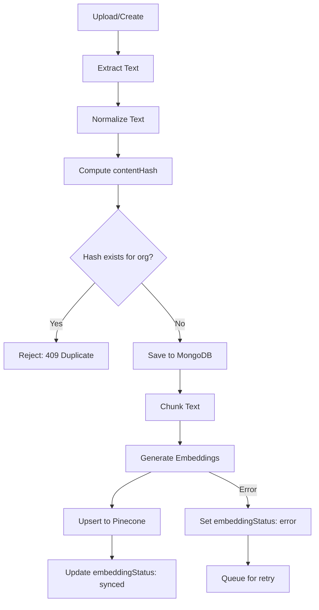
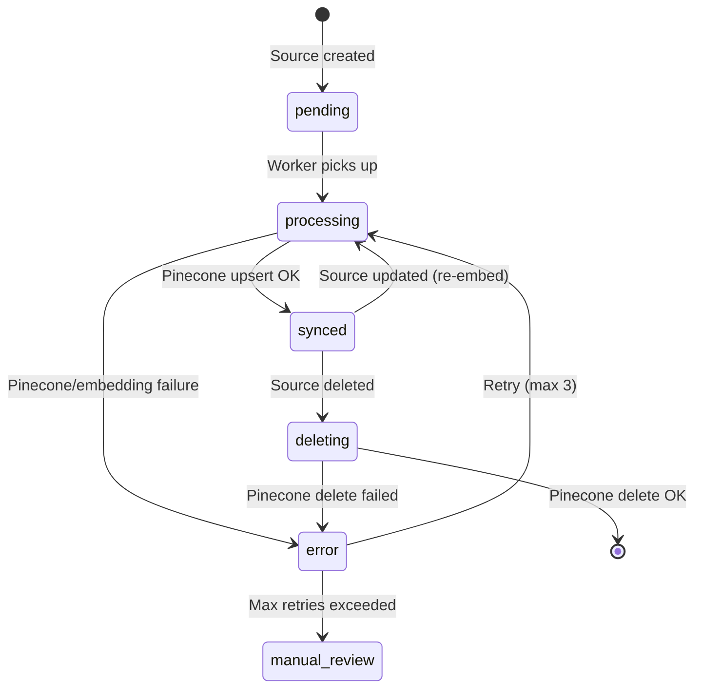

# 04 — Pinecone & Firecrawl Design

## Overview

Pinecone serves as the vector database for organization-scoped knowledge base (KB) retrieval-augmented generation (RAG). Firecrawl handles website URL ingestion. All operations are strictly namespace-isolated by `organizationId`.

---

## Pinecone Architecture

### Index Configuration

| Setting | Value | Rationale |
|---------|-------|-----------|
| Index name | `customer-service-kb` | Single index for all orgs |
| Dimensions | `1536` (OpenAI `text-embedding-3-small`) or `3072` (text-embedding-3-large) | Match embedding model |
| Metric | `cosine` | Standard for semantic search |
| Cloud/Region | AWS `us-east-1` (or nearest) | Low latency |
| Pod type | Serverless (recommended) | Cost-effective for multi-tenant |

### Namespace Strategy

```
Namespace = organizationId.toString()
```

- Each organization's KB vectors live in their own Pinecone namespace
- **No cross-namespace queries are ever possible** — this is Pinecone's isolation model
- Creating/deleting an org namespace is implicit (Pinecone creates on first upsert)

### Vector Metadata Schema

Each vector in Pinecone stores the following metadata:

```typescript
interface PineconeMetadata {
  organizationId: string;     // Redundant with namespace, but useful for logging
  sourceId: string;           // Ref → knowledgeSources._id
  sourceType: string;         // 'text' | 'pdf' | 'docx' | 'website' | etc.
  chunkIndex: number;         // Position within document (0-based)
  totalChunks: number;        // Total chunks in source document
  title: string;              // Source document title (for display)
  text: string;               // FULL chunk text (NOT a preview) — search returns
                              //   this to the agent, so truncating it drops
                              //   retrievable content. Capped only to stay under
                              //   Pinecone's ~40KB/vector metadata limit.
  createdAt: string;          // ISO timestamp
}
```

> **Re-ingest must purge stale vectors.** After upserting the new chunk set,
> delete any previous `pineconeIds` not in the new set (upsert-then-delete).
> Otherwise a re-ingest that yields fewer chunks orphans the old high-index
> vectors. (`ingestSource` does this; the `/knowledge/:id/reingest` route relies on it.)

> **Per-page chunk attribution must survive re-ingest (Changelog 2).** Each website
> chunk stores its **originating page URL** in Pinecone `metadata.url` so citations
> deep-link to the exact page, not the site's base URL. The live-crawl path sets this
> per page; the **reconcile / reingest** path (`ingestSource`) must too. It works off
> the stored `extractedText` (per-page blocks `"# <pageUrl>\n\n<markdown>"` joined by
> `---`): `splitCrawledPages()` reconstructs the pages (splitting on the page-URL
> headers, not the `---` separators, so an in-page markdown rule can't cause a false
> split) and each chunk is tagged with its page URL. A reingest that re-chunks the
> concatenated text as one blob and tags every chunk with the base `sourceUrl` (the
> old bug) collapses all citations to the homepage.

### Vector ID Convention

```
{sourceId}_{chunkIndex}
```

Example: `665a1b2c3d4e5f001a2b3c4d_0`, `665a1b2c3d4e5f001a2b3c4d_1`, etc.

This convention enables:
- Easy bulk deletion: delete all vectors where ID starts with `sourceId`
- No ID collisions across sources

---

## Ingestion Pipeline (by source type)

### Common Pipeline Steps



### Per-Type Processing

#### 1. Plain Text
```
Input: raw text string
Extract: use as-is
Normalize: trim, collapse whitespace
Chunk: split by paragraphs → fixed-size windows (~300 tokens / 1200 chars, ~150 char overlap — finer than the original 512 for more precise retrieval; see utils/chunker.ts)
Embed: OpenAI text-embedding-3-small
Upsert: Pinecone namespace = orgId
```

#### 2. PDF
```
Input: uploaded PDF file
Extract: pdf-parse (or pdf.js) → raw text per page
Normalize: strip headers/footers, join pages
Chunk: ~300 tokens / 1200 chars, ~150 char overlap
Embed → Upsert
```
**Library**: `pdf-parse` or `@mozilla/readability` for complex PDFs

#### 3. DOCX
```
Input: uploaded .docx file
Extract: mammoth → HTML → strip tags → plain text
Normalize: collapse whitespace
Chunk → Embed → Upsert
```
**Library**: `mammoth`

#### 4. Excel / CSV
```
Input: uploaded .xlsx or .csv file
Extract: xlsx → iterate rows → join as "Header: Value" per row
         csv → parse rows → same
Normalize: one "document" per sheet/file
Chunk → Embed → Upsert
```
**Library**: `xlsx` (SheetJS) for Excel, `csv-parse` for CSV

#### 5. Image
```
Input: uploaded image (PNG, JPG, WEBP)
Extract: Send to vision model (GPT-4o or similar)
         → Generate comprehensive text description
         OR: Tesseract.js OCR for text-heavy images
Normalize: use description/OCR output as text
Chunk → Embed → Upsert
```
**Library**: `openai` SDK (vision) or `tesseract.js` (OCR)
**Decision**: OCR for text heavy images and documents/screenshots, Only use vision model for non-text images

#### 6. HTML
```
Input: raw HTML content (pasted or uploaded .html file)
Extract: Convert HTML → Markdown (turndown)
Normalize: strip markdown formatting artifacts
Chunk → Embed → Upsert
```
**Library**: `turndown` (HTML → Markdown)

#### 7. Website URL (Firecrawl)
```
Input: URL string
Extract: Firecrawl crawl API → returns pages as Markdown
Normalize: per page, clean Markdown
Chunk each page → Embed → Upsert
Store: one KnowledgeSource per URL, with child chunks
```

---

## Firecrawl Integration

### Configuration

```typescript
import FirecrawlApp from '@mendable/firecrawl-js';

const firecrawl = new FirecrawlApp({
  apiKey: process.env.FIRECRAWL_API_KEY
});
```

### Crawl Flow

```typescript
async function crawlWebsite(url: string, orgId: string): Promise<void> {
  // 1. Start crawl job
  const crawlResult = await firecrawl.crawlUrl(url, {
    limit: 50,                    // Max pages per crawl
    scrapeOptions: {
      formats: ['markdown'],      // Get Markdown, not raw HTML
    }
  });

  // 2. Process each page
  for (const page of crawlResult.data) {
    const text = page.markdown;
    const contentHash = computeHash(text);
    
    // 3. Dedup check
    const existing = await KnowledgeSource.findOne({ organizationId: orgId, contentHash });
    if (existing) continue; // Skip duplicate pages
    
    // 4. Save source record
    const source = await KnowledgeSource.create({
      organizationId: orgId,
      type: 'website',
      title: page.metadata?.title || url,
      sourceUrl: page.metadata?.sourceURL || url,
      extractedText: text,
      contentHash,
      embeddingStatus: 'processing'
    });
    
    // 5. Chunk and embed
    const chunks = chunkText(text, { maxTokens: 512, overlap: 64 });
    const embeddings = await generateEmbeddings(chunks);
    
    // 6. Upsert to Pinecone
    await pineconeIndex.namespace(orgId).upsert(
      chunks.map((chunk, i) => ({
        id: `${source._id}_${i}`,
        values: embeddings[i],
        metadata: {
          organizationId: orgId,
          sourceId: source._id.toString(),
          sourceType: 'website',
          chunkIndex: i,
          totalChunks: chunks.length,
          title: source.title,
          contentPreview: chunk.slice(0, 200)
        }
      }))
    );
    
    // 7. Update source
    await KnowledgeSource.updateOne(
      { _id: source._id },
      {
        embeddingStatus: 'synced',
        chunkCount: chunks.length,
        pineconeIds: chunks.map((_, i) => `${source._id}_${i}`),
        lastSyncedAt: new Date()
      }
    );
  }
}
```

### Crawl Limits by Plan (configurable)

| Plan | Max pages per crawl | Max total KB sources | Max single file size |
|------|--------------------|-----------------------|---------------------|
| Free | 10 | 20 | 10 MB |
| Starter | 25 | 100 | 25 MB |
| Pro | 50 | 500 | 50 MB |
| Enterprise | 100 | Unlimited | 100 MB |

---

## CRUD Sync Rules

> **Invariant: `synced` ⟺ vectors exist in Pinecone.** `embeddingStatus: 'synced'`
> must *only* be set by the ingestion pipeline after a successful upsert, and a
> synced source must have a non-empty `pineconeIds`. Never write `synced`
> directly — seed scripts, fixtures, and migrations must route content through
> `ingestSource()` like any other create. (Bug history: a seed that hardcoded
> `synced` with empty `pineconeIds` left KB search returning zero hits, so the
> bot answered "I couldn't find that information" for content the dashboard
> showed as synced. Use `pnpm --filter @csb/api kb:reembed` to repair any
> sources with empty `pineconeIds`.)

> **Batching (required for large docs).** A multi-MB document produces hundreds
> or thousands of chunks. Both the embedding call and the Pinecone upsert MUST
> be batched, otherwise a single oversized request hits provider/Pinecone limits
> and the document lands only partially (or not at all):
> - `embed()` splits inputs into batches of `EMBEDDING_BATCH_SIZE` (default 96).
> - Pinecone `upsert` batches ≤100 records/request; `deleteMany` batches ≤1000 ids.

> **Pinecone delete uses raw HTTP, not the SDK.** `@pinecone-database/pinecone`
> v7.2.0's `index.deleteMany(ids)` omits the `ids` from the request body (it
> posts only `{namespace}`), so the server returns "Invalid request" and the
> source stays stuck in `deleting`. `config/pinecone.ts` therefore deletes by
> POSTing `{ids}` to the data-plane `/vectors/delete` endpoint directly.

### Create
1. Extract text from source
2. Compute `contentHash`
3. Check for duplicate hash within org → reject if exists
4. Save MongoDB record with `embeddingStatus: 'pending'`
5. Chunk → embed (batched) → upsert (batched) to Pinecone
6. Update `embeddingStatus: 'synced'`, store `pineconeIds`

### Read
- List sources: query MongoDB (`{ organizationId }`)
- No Pinecone interaction needed for listing

### Update
1. Re-extract text from new content/file
2. Compute new `contentHash`
3. If hash unchanged → no-op
4. If hash changed:
   a. Delete old Pinecone vectors (`pineconeIds` from previous version)
   b. Re-chunk → re-embed → upsert new vectors
   c. Update MongoDB: new `contentHash`, new `pineconeIds`, increment `version`, `embeddingStatus: 'synced'`

### Delete
The `DELETE /knowledge/:id` route purges **synchronously** so deletion completes
within the request (no lingering `deleting` state):
1. Purge Pinecone vectors using stored `pineconeIds` (batched HTTP delete)
2. Delete the MongoDB record
3. Emit `knowledge:deleted` (so other dashboard tabs drop the row)
4. **Only if the purge throws** → mark `embeddingStatus: 'deleting'` and let the
   reconciliation job retry (the previous always-deferred approach left sources
   stuck forever whenever the purge failed).

---

## Error Handling & Reconciliation

### Embedding Status State Machine



### Reconcile job (runs every 60s)
1. Re-ingest `error` sources with `retryCount < 3`.
2. **Recover interrupted ingests** — sources stuck in `processing` with
   `updatedAt` older than 15 min (e.g. the API restarted mid-ingest, which for a
   multi-MB / thousands-of-chunks document can take minutes) are re-ingested.
   Re-ingestion is idempotent: the same vector ids are overwritten. Without this
   an interrupted large ingest would sit in `processing` forever with only
   partial vectors in Pinecone.
3. Finalise `deleting` sources (purge vectors + drop the doc) as a fallback for
   the rare case the synchronous delete in the route failed.

### Reconciliation Job

Runs every **15 minutes** (configurable via cron):

```typescript
async function reconcileEmbeddings() {
  // 1. Retry failed embeddings (max 3 retries)
  const failed = await KnowledgeSource.find({
    embeddingStatus: 'error',
    retryCount: { $lt: 3 }
  });
  
  for (const source of failed) {
    try {
      await processEmbedding(source);
    } catch (err) {
      await KnowledgeSource.updateOne(
        { _id: source._id },
        { $inc: { retryCount: 1 }, embeddingError: err.message }
      );
    }
  }
  
  // 2. Clean up orphaned "deleting" records
  const deleting = await KnowledgeSource.find({ embeddingStatus: 'deleting' });
  for (const source of deleting) {
    try {
      await pineconeIndex.namespace(source.organizationId.toString())
        .deleteMany(source.pineconeIds);
      await KnowledgeSource.deleteOne({ _id: source._id });
    } catch (err) {
      logger.error('Reconciliation delete failed', { sourceId: source._id, err });
    }
  }
}
```

---

## AI Search Tool (Query Contract)

The shared AI agent's `search` tool queries Pinecone with org-scoped namespace:

```typescript
interface SearchToolInput {
  query: string;       // Natural language query from user message
  topK?: number;       // Default: 5
}

interface SearchToolOutput {
  results: Array<{
    content: string;     // Chunk text
    title: string;       // Source document title
    sourceType: string;  // 'text' | 'pdf' | 'website' | etc.
    score: number;       // Cosine similarity (0-1)
  }>;
}

async function searchKnowledgeBase(
  orgId: string,
  input: SearchToolInput
): Promise<SearchToolOutput> {
  // 1. Embed the query
  const queryEmbedding = await generateEmbedding(input.query);
  
  // 2. Query Pinecone (ALWAYS use org namespace)
  const results = await pineconeIndex
    .namespace(orgId)  // ← Critical: org isolation
    .query({
      vector: queryEmbedding,
      topK: input.topK || 5,
      includeMetadata: true
    });
  
  // 3. Format results for agent
  return {
    results: results.matches.map(match => ({
      content: match.metadata.contentPreview,
      title: match.metadata.title,
      sourceType: match.metadata.sourceType,
      score: match.score
    }))
  };
}
```

---

## Chunking Strategy

### Parameters

| Parameter | Value | Rationale |
|-----------|-------|-----------|
| Max chunk size | 512 tokens | Balance between context and precision |
| Overlap | 64 tokens | Preserve cross-boundary context |
| Separator priority | `\n\n` > `\n` > `. ` > ` ` | Prefer paragraph boundaries |
| Min chunk size | 50 tokens | Skip trivially small chunks |

### Implementation

```typescript
function chunkText(text: string, options: {
  maxTokens?: number;
  overlap?: number;
}): string[] {
  const { maxTokens = 512, overlap = 64 } = options;
  
  // 1. Split by paragraphs first
  const paragraphs = text.split(/\n\n+/);
  
  // 2. Merge small paragraphs, split large ones
  const chunks: string[] = [];
  let current = '';
  
  for (const para of paragraphs) {
    if (tokenCount(current + para) <= maxTokens) {
      current += (current ? '\n\n' : '') + para;
    } else {
      if (current) chunks.push(current);
      // Split large paragraph by sentences if needed
      if (tokenCount(para) > maxTokens) {
        chunks.push(...splitBySentences(para, maxTokens));
      } else {
        current = para;
      }
    }
  }
  if (current) chunks.push(current);
  
  // 3. Add overlap between chunks
  return addOverlap(chunks, overlap);
}
```

---

## Conflicting sources (Changelog 14)

Spec: [`44-knowledge-conflicts.md`](44-knowledge-conflicts.md).

Two fields were added to `KnowledgeSource` and mirrored onto every chunk:

- **`priority`** (integer, default 0) — operator-set authority. Higher wins when
  two sources contradict each other.
- **`sourceUpdatedAt`** — when the source's **content** last changed. Distinct
  from `updatedAt`, which moves on every reingest, retry and status change and
  therefore says nothing about which of two documents is more current.

Both are denormalised onto `kbchunks` at ingest, because conflict resolution
reads them for every candidate on the retrieval hot path and a join per hit would
not pay for itself.

**The backfill was metadata-only — no vector was re-embedded.** Retrieval reads
these fields from the Mongo mirror rather than from Pinecone metadata (see the
hybrid-retrieval spec), so `scripts/backfill-conflict-metadata.ts` is a Mongo
update. Had retrieval still read Pinecone metadata, this would have required
extending the client wrapper (which exposes only `upsert`, `query`, `deleteMany`)
or a full re-embed. New ingests do write both fields into Pinecone metadata for
consistency; old vectors lack them, which is harmless because they are only the
fallback path.

Changing `priority` from the UI does **not** trigger a reingest and does not move
`sourceUpdatedAt`: it is metadata, not content.

---

## Vector-store tenancy: filtering today, namespaces later

**What the code does.** Vectors for every organization share one Pinecone
namespace. Isolation comes from two things working together in
`services/kb/search.service.ts`:

1. Every query carries an AND-ed metadata filter on `organizationId` **and**
   `agentId`. Either alone would be insufficient — the org alone leaks between
   agents in one workspace, the agent alone relies on ids never being reused.
2. A query that arrives without an `agentId` is **refused and logged**, not run.
   That is the dangerous case: an empty filter field silently means "everything",
   and the failure would look like unusually good retrieval rather than a leak.

`__tests__/vector-tenancy.test.ts` asserts both, plus that a vector-store outage
degrades to zero hits rather than to an unfiltered query.

**What the spec used to claim.** [`12-security-compliance.md`](12-security-compliance.md)
§1.3 stated "Pinecone namespace = `organizationId`; no default/fallback namespace
ever" and marked it 🔴 Critical. That was never implemented — see the note at
`services/kb/ingestion.service.ts` where the upsert happens. The spec has been
corrected to describe the mechanism that exists. **A spec that claims a stronger
guarantee than the code provides is worse than one that admits the weaker one**,
because it is the document a reviewer trusts.

**Why namespaces have not shipped.** Every existing vector lives in the default
namespace. Switching writes to `pinecone.namespace(orgId)` makes every already-
indexed knowledge base invisible until it is re-embedded — a migration with real
customer impact and real embedding cost, not a code change. It is worth doing:
namespaces are physical partitioning, and the current design puts a single filter
clause between two tenants.

**If it is done**, the isolation tests above should pass unchanged — they assert
the outcome (no cross-tenant hit), not the mechanism.

---

## Index health: closing the loop from query logs (Changelog 3)

Ingestion gets content INTO the index. This is about what happens to it after:
which passages earn their place, which gaps keep going unanswered, and what an
operator does about either. Service:
`apps/api/src/services/kb/index-health.service.ts`. Surfaced on the RAG Quality
page ([`11-page-wiremap.md`](11-page-wiremap.md)).

### Scored per chunk, not per source

A document is rarely uniformly good, and the repair for one badly-split passage
is not the repair for a bad document. Scoring at source granularity averages the
two together and points the operator at the wrong fix.

This needed an input the telemetry did not have. `RagTurnMetric.retrieval`
recorded `sourceIds`; it now also records `retrieval.chunks`, one entry per
retrieved passage in rank order:

| Field | Meaning |
| --- | --- |
| `chunkId` / `sourceId` | Which passage, and which document it came from |
| `rank` | 0-based position in the deduplicated list the prompt saw |
| `score` | Raw similarity, always on the cosine scale |
| `rerankScore` | Calibrated cross-encoder score, null when stage 2 did not run |
| `cited` | Whether the reply actually quoted it |

`cited` is the half that has to be recorded rather than derived: a passage that
was retrieved and then ignored leaves no trace anywhere else, and it is the most
diagnostic signal in the set. Bounded by `AI_KB_SEARCH_TOP_K`, written on the
same fire-and-forget document as the rest of the turn's telemetry.

### The three flags

Kept apart because each has a different repair.

| Flag | Condition | What it means | The repair |
| --- | --- | --- | --- |
| `dead_weight` | Zero retrievals in the window | Nobody asks about it, or it does not match the words they use | Delete it, or rewrite it in the customer's vocabulary |
| `misleading` | Downvote rate among **citing** answers ≥ `KB_HEALTH_DOWNVOTE_RATE` | It is being quoted and the answers are wrong | Fix the content. This one is actively costing you |
| `retrieved_not_cited` | Citation rate ≤ `KB_HEALTH_UNCITED_RATE` **and** score ≥ `KB_HEALTH_STRONG_SCORE` | Reaches the prompt, model declines to quote it | Usually a chunking defect: the sentence that answers the question got split away |

Three decisions worth stating:

- **Every rate sits behind `KB_HEALTH_MIN_RETRIEVALS`.** A chunk retrieved twice,
  once downvoted, is not a 50 percent downvote rate — it is two retrievals.
  `dead_weight` needs no floor, because zero is not a rate.
- **Thumbs are attributed only to turns that CITED the chunk.** A downvote on an
  answer that merely had the passage in its context is not evidence against the
  passage.
- **`retrieved_not_cited` is gated on the score**, and prefers the calibrated
  rerank score over the raw cosine when one exists. Without the gate, a passage
  that scraped into the prompt on a thin query and was rightly ignored gets
  reported as a chunking defect.

No thumbs at all leaves `downvoteRate` null, not zero: "nobody said" and
"everybody approved" are different facts.

### Gap clustering

23 customers asking one question in 23 phrasings is one problem. `KnowledgeGap`
records the phrasings; clustering turns them back into the problem.

Greedy single-pass agglomerative clustering on embedding cosine, at
`KB_HEALTH_GAP_SIMILARITY`. Greedy rather than k-means because the number of
distinct topics is exactly what is unknown, and asking an operator to pick a `k`
for their own knowledge gaps is asking the wrong person the wrong question.
Processed highest-volume-first, so the result is deterministic and a reload
compares cleanly; the centroid is a running mean, so a cluster drifts toward its
members rather than being pinned to whichever query arrived first.

Embeddings are **cached on the gap document** (`embedding`, `embeddingModel`).
Without that, opening the page re-embeds every open gap on every load — a cost
that grows with exactly the thing the page exists to reduce. The model tag is
what stops a model change silently comparing two vector spaces.

**The threshold is measured.** The first guess, 0.86, turned out to cluster
essentially nothing: real paraphrases of one question sit far lower than
intuition suggests, and their similarity distribution overlaps with that of
merely-related questions. Swept over a seeded gap set of 7 queries, 5 of which
were paraphrases of "how long do EU refunds take":

| Threshold | Clusters from 7 queries | Largest cluster |
| --- | --- | --- |
| 0.86 | 6 | 2 |
| 0.80 | 5 | 2 |
| 0.75 | 5 | 2 |
| 0.70 | 4 | 3 |
| 0.65 | 4 | 3 |
| 0.60 | 4 | 3 |
| 0.55 | **3** | **5** |
| 0.50 | 3 | 5 |

Measured pairwise cosines on that set: within-topic min 0.425 / median 0.672 /
max 0.863; against the two related-but-different refund queries, min 0.320 /
median 0.460 / max 0.836. **The two distributions overlap**, so no threshold
separates them cleanly — 0.55 is chosen to favour collapsing a question into one
row over keeping near-duplicates apart, because the failure this feature exists
to fix is 23 rows that should have been 1.

Seven queries from one corpus is a starting point, not a tuned optimum. It is an
env var because the right value depends on the embedding model and on how varied
the questions are.

Ranked by `volume × (1 + escalationRate)`. Multiplicative with a `1 +` floor so
escalation scales volume instead of competing with it: 40 people asking
something that always escalates outranks 40 people asking something the bot
muddles through, but neither is beaten by 3 people asking something that always
escalates. Escalation is joined through the PII mask, since telemetry stores
`originalQuery` masked and `KnowledgeGap.queryUsed` raw.

### Repair actions

All four are operator-initiated, org-scoped, and require admin or above.

| Action | Route | Notes |
| --- | --- | --- |
| Targeted re-index | `POST /index-health/sources/:id/reindex` | Purges that source's vectors **first**, then re-ingests. The reason you are here is that the current vectors are wrong, and upserting over them leaves every chunk the new chunking no longer produces exactly where it was |
| Answer a gap | `POST /index-health/gap-clusters/answer` | Creates a `text` source at priority 5, stored as `Q: … / A: …` so the customer's own vocabulary is embedded alongside the answer. Closes the cluster's gaps only after the source exists |
| Mark stale / re-prioritise | `POST /index-health/sources/:id/mark` | Metadata only: never re-embeds, never moves `sourceUpdatedAt`. Priority is mirrored onto `KbChunk`, where conflict resolution reads it on the hot path |
| Bulk delete dead weight | `POST /index-health/sources/bulk-delete` | Two steps. See below |

**A stale source stays indexed and retrievable.** Hiding it silently would turn
"this answer is out of date" into "we have no answer", which is worse. The flag
is what the health surface sorts and filters on.

### Deletion requires a review step

Not a boolean the caller sets. `POST /index-health/sources/bulk-delete/preview`
returns the candidate list and an HMAC over **that exact set**, the org, and the
moment it was issued. The delete route recomputes it and refuses a mismatch, an
expiry past 15 minutes, or a `confirm` that is not literally `true`.

Then it re-checks the claim the token approved against the world as it is now: a
source that started being retrieved between the review and the confirm is no
longer dead weight, and a token is a receipt for a review rather than a licence
to delete something that has since changed.

Stateless on purpose — a `pendingDeletions` collection would be one more thing
to expire, scope and keep in sync, to express what an HMAC already says.

### The scheduled job, and what it is not allowed to do

`apps/api/src/jobs/index-health.job.ts`, **off by default**
(`KB_INDEX_HEALTH_ENABLED`). The scoring has to be watched against real traffic
before a job is allowed to act on it.

It does two things:

1. **Drift repair.** Re-embeds sources whose stored text no longer hashes to the
   `contentHash` their vectors were built from, capped at
   `KB_INDEX_HEALTH_MAX_REEMBED_PER_RUN`. The selection is the mismatch itself,
   so a corpus that has not drifted costs one indexed find and nothing else.
   **This is never a full reindex.** The hash is stamped before the re-embed, or
   the same source would be repaired every night forever.
2. **Review notification.** Raises one `kb_weak_chunks` notification per org per
   day when anything is flagged. It changes nothing.

**It never deletes and never edits customer knowledge.** Re-embedding rebuilds
vectors from the operator's text; it must never rewrite the text. The
destructive routes are not imported, and `index-health.test.ts` asserts that
from the job's source rather than trusting this paragraph.

Work is gated to `KB_INDEX_HEALTH_HOUR_UTC` while the tick itself is frequent, so
a restart at any time of day cannot miss the window and cannot re-embed during
business hours either. Re-embedding competes with live retrieval for the same
provider quota, and a repair that slows the thing it is repairing is not a
repair.

---

## Ingestion observability (Changelog 15)

Before this, a failed ingest stored one raw provider string in `embeddingError`
and incremented `retryCount`. "It failed" was the entire diagnosis, and the retry
loop treated every failure identically.

### The error taxonomy

`services/kb/ingestion-errors.ts` classifies every failure into one of ten codes,
each carrying an **operator-readable message**, a **suggested action**, and a
**retry policy**. The last is separate from the first two on purpose: what an
operator should do and what the retry loop should do are different questions.

| Policy | Classes | Behaviour |
| --- | --- | --- |
| `never` | `unsupported_file_type`, `parse_failure`, `empty_extraction` | Consumes **zero** retries, goes terminal and visible |
| `backoff` | `embedding_provider_error`, `rate_limited`, `pinecone_upsert_failure`, `partial_upsert`, `timeout`, `unknown` | Bounded retries with exponential backoff |
| `deferred` | `budget_exceeded` | Waits without consuming attempts |

An unrecognised failure classifies as `unknown` and **retries**. Defaulting to
permanent would strand sources on a provider error whose wording we have not seen
yet.

### `empty` is a status, not a flavour of `synced`

A zero-chunk ingest — a scanned PDF with no text layer, an empty crawl — used to
end as `synced` with `chunkCount: 0`, looking identical to a working source while
retrieving nothing. It now has its own status. This mattered more than it looks:
the reconcile job only ever revisited `error` and `processing`, so a zero-chunk
source was never looked at again by anything.

### `IngestionEvent`: a separate collection

One row per stage per attempt, rather than an array on `KnowledgeSource`:

- It grows without bound (five stages per attempt, three retries, re-crawls), and
  the source document is read during retrieval hydration.
- The dashboard aggregates **across** sources, which an embedded array cannot
  answer without unwinding every source in the org.
- It needs its own 30-day retention.

Events are buffered per run and flushed once rather than issuing five inline
round trips, and a failed event write never fails the ingest — a diagnostic that
breaks the thing it diagnoses is worse than none.

A `runId` ties every stage of one attempt together, so an operator sees "this was
re-ingested four times" rather than twenty ungrouped rows.

### The reconcile job is now discriminating, and visible

It always retried failures and recovered interrupted ingests. What changed:

- Permanent classes are not retried at all. Previously an unsupported file type
  burned three attempts in three minutes then sat silent forever.
- Transient classes back off exponentially instead of retrying on a flat 60s
  loop, which hammered a rate-limited provider at the rate that got us limited.
- Budget-exceeded waits without consuming attempts, which would otherwise be
  exhausted before the budget ever reset.
- Exhausting retries **raises** something instead of going quiet, latched so it
  does not re-alert every tick.
- Every retry and recovery emits an event.

### `embeddingError` has two readers

`POST /knowledge/website` parks an in-flight crawl id there as `firecrawl:<id>`
for the poll job to read back, leaving the source in `processing` while Firecrawl
works — routinely longer than the stuck threshold.

**The reconcile job now skips website sources whose `embeddingError` holds a
crawl id.** Without that exemption it re-ingested them at the 15-minute mark,
clobbering the crawl id and stranding the crawl permanently. That was a live bug,
not a hypothetical.

