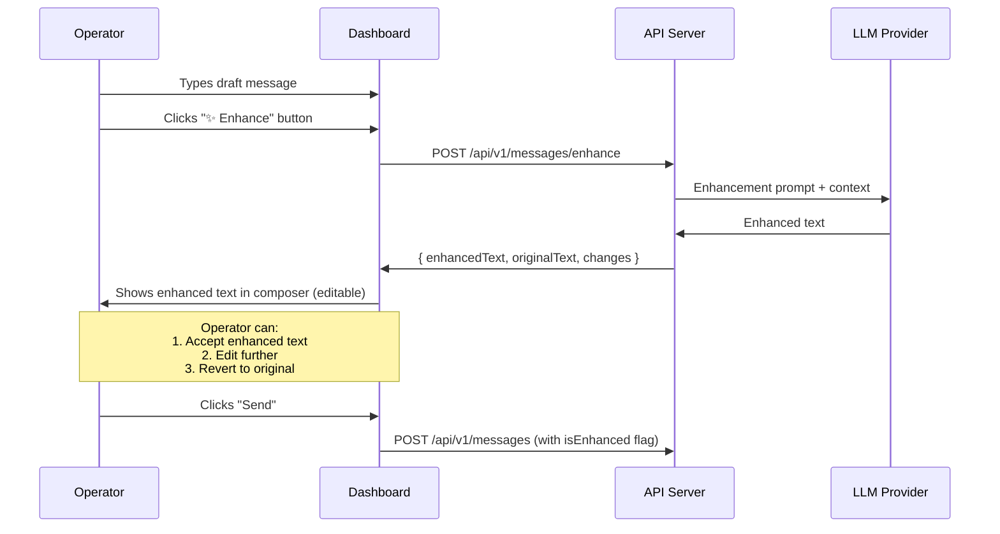

# 06 — Operator Enhancement LLM

## Overview

A **separate LLM endpoint** (not the customer-facing agent) that polishes operator message drafts before sending. The enhancement preserves the operator's intent and meaning while improving clarity, tone, and professionalism.

---

## API Endpoint

```
POST /api/v1/messages/enhance
```

| Field | Description |
|-------|-------------|
| **Auth** | Bearer JWT (authenticated operator only) |
| **Org check** | Operator must be a member of the conversation's organization |

### Request Body

```typescript
interface EnhanceMessageRequest {
  conversationId: string;    // The conversation thread
  draftText: string;         // Operator's raw draft message
  tone?: 'professional' | 'friendly' | 'empathetic' | 'concise';  // Default: 'professional'
}
```

### Response

```typescript
interface EnhanceMessageResponse {
  enhancedText: string;      // Polished message
  originalText: string;      // Echo back for comparison
  changes: string[];         // List of changes made (for transparency)
}
```

### Error Responses

| Status | Condition |
|--------|-----------|
| `400` | Empty draft text |
| `401` | Not authenticated |
| `403` | Not a member of the conversation's org |
| `404` | Conversation not found |
| `429` | Rate limit exceeded |
| `500` | LLM provider error |

---

## Enhancement System Prompt

```
You are a message enhancement assistant for customer support operators. Your job is to polish draft messages while strictly preserving the operator's intent.

## Rules
1. PRESERVE the exact meaning, intent, and information of the original message
2. DO NOT add new information, facts, promises, or commitments not in the original
3. DO NOT remove critical information from the original
4. Improve grammar, spelling, and punctuation
5. Improve clarity and readability
6. Maintain a {tone} tone (professional/friendly/empathetic/concise)
7. Use appropriate customer support language
8. Keep the message length similar to the original (±30%)
9. If the original message is already well-written, return it with minimal changes
10. NEVER fabricate technical details, pricing, or policy information

## Previous Conversation (for context)
{conversationHistory}

## Operator's Draft
{draftText}

## Instructions
Enhance the draft message above. Return ONLY the enhanced message text, nothing else.
```

---

## Implementation

```typescript
// services/ai/enhance.service.ts

const ENHANCE_MODEL = process.env.ENHANCE_LLM_MODEL || 'openai/gpt-4o-mini';

async function enhanceOperatorMessage(params: {
  conversationId: string;
  draftText: string;
  tone?: string;
  orgId: string;
}): Promise<EnhanceMessageResponse> {
  const { conversationId, draftText, tone = 'professional', orgId } = params;
  
  // 1. Load conversation history (last 20 messages for context)
  const messages = await Message.find({ conversationId })
    .sort({ createdAt: -1 })
    .limit(20)
    .lean();
  
  const conversationHistory = messages
    .reverse()
    .map(m => `[${m.role}]: ${m.content}`)
    .join('\n');
  
  // 2. Build enhancement prompt
  const systemPrompt = ENHANCE_SYSTEM_PROMPT
    .replace('{tone}', tone)
    .replace('{conversationHistory}', conversationHistory)
    .replace('{draftText}', draftText);
  
  // 3. Call LLM
  const response = await llmClient.chat.completions.create({
    model: ENHANCE_MODEL,
    messages: [
      { role: 'system', content: systemPrompt },
      { role: 'user', content: draftText }
    ],
    temperature: 0.3,  // Lower temperature for more predictable enhancement
    max_tokens: 512
  });
  
  const enhancedText = response.choices[0].message.content.trim();
  
  // 4. Generate change summary
  const changes = identifyChanges(draftText, enhancedText);
  
  return {
    enhancedText,
    originalText: draftText,
    changes
  };
}
```

---

## Frontend UX Flow



### Composer UI Behavior

1. **Enhance button** (✨ icon) appears next to the send button in the conversation thread composer
2. On click: show loading spinner, disable button
3. On response: replace composer text with enhanced version
4. Show diff indicator (subtle highlight of changes)
5. **"Undo"** button to revert to original draft
6. When sent: store both `content` (enhanced) and `originalContent` (original) on the message record, set `isEnhanced: true`

---

## Rate Limiting

| Scope | Limit | Window |
|-------|-------|--------|
| Per operator | 30 enhancements | 1 hour |
| Per organization | 200 enhancements | 1 hour |

---

## Differences from Customer-Facing Agent

| Aspect | Customer Agent (§05) | Enhancement LLM (§06) |
|--------|---------------------|----------------------|
| Purpose | Answer customer questions | Polish operator drafts |
| Tools | search, resolve, escalate | None |
| Temperature | 0.7 | 0.3 |
| Context | Full system prompt + KB | Conversation history only |
| Caller | Triggered by customer message | Triggered by operator button |
| Model | Configurable per agent | Separate env var |
| Auth | Widget session token | Operator JWT |
