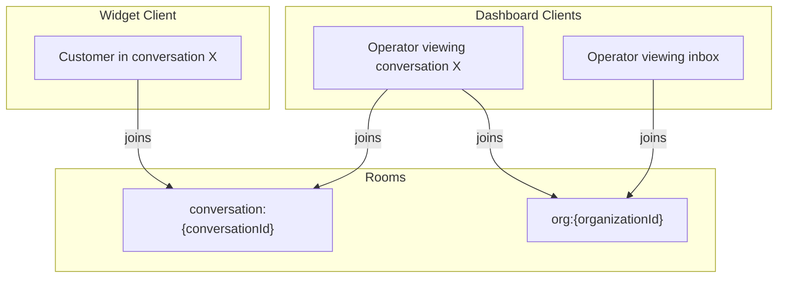
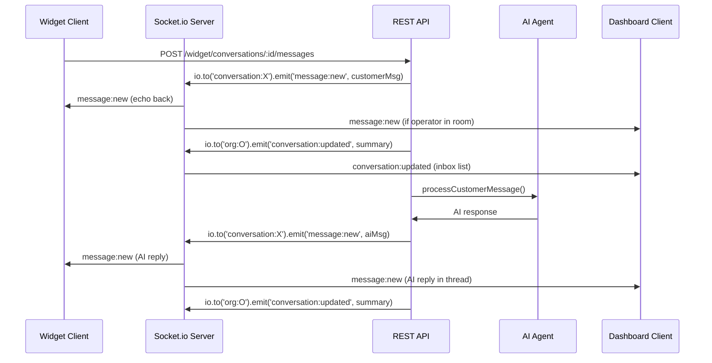
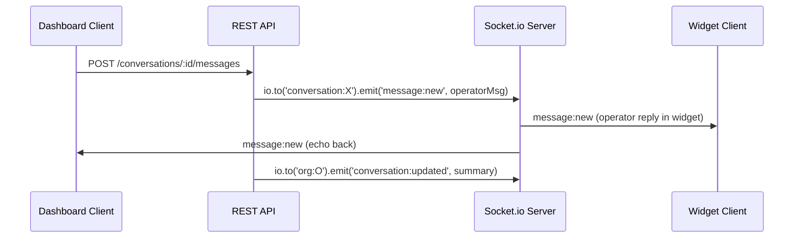
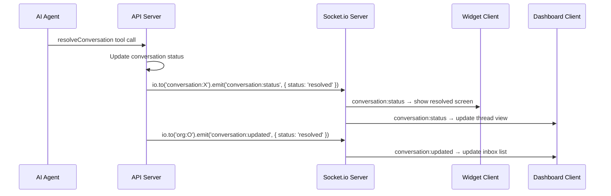

# 08 — Socket.io Design

## Overview

Socket.io provides real-time bi-directional communication between the API server and three client types:
1. **Widget client** — end customer chat
2. **Dashboard client** — operator inbox + thread view
3. **API internals** — emitting events from REST handlers

---

## Server Setup

### Initialization

```typescript
// apps/api/src/socket/index.ts
import { Server as SocketIOServer } from 'socket.io';
import { createServer } from 'http';
import { app } from '../index';

const httpServer = createServer(app);

const io = new SocketIOServer(httpServer, {
  cors: {
    origin: [
      process.env.WEB_URL,      // Dashboard: http://localhost:3000
      process.env.WIDGET_URL,   // Widget: http://localhost:3001
    ],
    credentials: true
  },
  path: '/socket.io',
  transports: ['websocket', 'polling'],
  pingInterval: 25000,
  pingTimeout: 20000,
});

export { io, httpServer };
```

---

## Client reconnection (dashboard)

The operator socket (`apps/web/src/lib/socket.ts`) must survive the 15-min
access-token expiry. Its `auth` is a **function** (not a static object), so
socket.io invokes it before every (re)connect and we fetch a fresh token from
`/api/session-token` each time (falling back to the last known token). Combined
with `reconnection: true` + `reconnectionAttempts: Infinity` (backoff capped at
10s), this means a disconnect (network blip, token expiry, API restart) silently
re-authenticates and resumes live updates instead of the socket dying for good.

Separately, server-side dashboard data fetches (`apps/web/src/lib/api.ts`) retry
idempotent **GET**s up to 3× on connection errors, so a brief API outage doesn't
surface as "Failed to load …".

## Authentication Middleware

Two auth strategies based on connection type:

```typescript
// apps/api/src/socket/auth.ts

io.use(async (socket, next) => {
  const clientType = socket.handshake.auth.clientType; // 'widget' | 'dashboard'
  
  if (clientType === 'dashboard') {
    // Operator: verify JWT
    const token = socket.handshake.auth.token;
    try {
      const decoded = jwt.verify(token, process.env.JWT_SECRET);
      socket.data.userId = decoded.userId;
      socket.data.orgId = decoded.organizationId;
      socket.data.clientType = 'dashboard';
      next();
    } catch (err) {
      next(new Error('Authentication failed'));
    }
  } else if (clientType === 'widget') {
    // Widget: verify session token
    const sessionToken = socket.handshake.auth.sessionToken;
    const session = await ContactSession.findOne({ 
      token: sessionToken,
      expiresAt: { $gt: new Date() }
    });
    if (!session) return next(new Error('Invalid session'));
    
    socket.data.sessionId = session._id;
    socket.data.orgId = session.organizationId;
    socket.data.clientType = 'widget';
    next();
  } else {
    next(new Error('Unknown client type'));
  }
});
```

---

## Room Strategy



### Room Types

| Room | Format | Joined By | Purpose |
|------|--------|-----------|---------|
| Conversation | `conversation:{conversationId}` | Widget client + operators viewing the thread | Message delivery, typing indicators, status changes |
| Organization | `org:{organizationId}` | All dashboard clients for that org | Inbox list updates (new conversations, status changes, new messages) |

### Join Logic

```typescript
io.on('connection', (socket) => {
  if (socket.data.clientType === 'dashboard') {
    // Auto-join org room for inbox updates
    socket.join(`org:${socket.data.orgId}`);
  }
  
  // Both widget and dashboard explicitly join conversation rooms
  socket.on('conversation:join', ({ conversationId }) => {
    // Verify access (widget: session owns conversation; dashboard: org owns conversation)
    socket.join(`conversation:${conversationId}`);
  });
  
  socket.on('conversation:leave', ({ conversationId }) => {
    socket.leave(`conversation:${conversationId}`);
  });
});
```

---

## Events

### Client → Server Events

| Event | Sender | Payload | Handler |
|-------|--------|---------|---------|
| `conversation:join` | Both | `{ conversationId }` | Join conversation room (after access check) |
| `conversation:leave` | Both | `{ conversationId }` | Leave conversation room |
| `typing:start` | Both | `{ conversationId, sender: { type, name? } }` | Broadcast typing indicator |
| `typing:stop` | Both | `{ conversationId }` | Clear typing indicator |
| `message:read` | Dashboard | `{ conversationId, messageId }` | Mark messages as read |

### Server → Client Events

| Event | Target Room | Payload | Description |
|-------|-------------|---------|-------------|
| `message:new` | `conversation:{id}` | `{ message: Message }` | New message in conversation. For AI messages, includes `confidence` score (0.0–1.0). |
| `conversation:status` | `conversation:{id}` + `org:{orgId}` | `{ conversationId, status, resolvedBy?, escalatedBy?, reason? }` | Status change (resolved, escalated, reopened). `reason` is `low_confidence` for auto-escalation. |
| `conversation:updated` | `org:{orgId}` | `{ conversationId, lastMessageAt, lastMessagePreview, status, unreadCount }` | Inbox list update (new message arrived, status changed) |
| `conversation:new` | `org:{orgId}` | `{ conversation: ConversationSummary }` | New conversation started (appears in inbox) |
| `conversation:assigned` | `org:{orgId}` | `{ conversationId, assignedOperatorId }` | Conversation assigned to operator |
| `conversation:escalated` | `org:{orgId}` | `{ conversationId, reason, priority, escalationType?, confidenceScore? }` | Conversation escalated. `escalationType` is `low_confidence` when auto-escalated due to AI confidence below threshold. |
| `typing:indicator` | `conversation:{id}` | `{ sender: { type, name? }, isTyping }` | Typing indicator |
| `contact:updated` | `conversation:{id}` + `org:{orgId}` | `{ conversationId, contact: { name, email, phone } }` | Contact info updated (for operator visibility) |
| `knowledge:updated` | `org:{orgId}` | `{ sourceId, embeddingStatus?, chunkCount?, lastSyncedAt?, embeddingError? }` | KB source status changed (`pending` → `processing` → `synced`/`error`/`deleting`). Emitted from `ingestSource()` and the DELETE route; the dashboard knowledge list patches its row in place so badges update live. |

---

## Event Flow Diagrams

### Customer Sends Message



### AI or Operator Sends Reply



### AI or Operator Resolves Conversation



---

## Client Integration

### Widget Client

```typescript
// apps/widget/src/lib/socket.ts
import { io, Socket } from 'socket.io-client';

let socket: Socket | null = null;

export function connectWidgetSocket(params: {
  apiUrl: string;
  sessionToken: string;
}) {
  socket = io(params.apiUrl, {
    auth: {
      clientType: 'widget',
      sessionToken: params.sessionToken
    },
    transports: ['websocket', 'polling'],
    reconnection: true,
    reconnectionAttempts: 10,
    reconnectionDelay: 1000,
  });
  
  socket.on('connect', () => {
    console.log('Widget socket connected');
  });
  
  return socket;
}

export function joinConversation(conversationId: string) {
  socket?.emit('conversation:join', { conversationId });
}
```

### Dashboard Client

```typescript
// apps/web/src/lib/socket.ts
import { io, Socket } from 'socket.io-client';

let socket: Socket | null = null;

export function connectDashboardSocket(params: {
  apiUrl: string;
  token: string; // JWT
}) {
  socket = io(params.apiUrl, {
    auth: {
      clientType: 'dashboard',
      token: params.token
    },
    transports: ['websocket', 'polling'],
    reconnection: true,
    reconnectionAttempts: Infinity,
    reconnectionDelay: 1000,
  });
  
  // Auto-joins org room via server-side connection handler
  
  return socket;
}
```

---

## Reconnection & Error Handling

| Scenario | Behavior |
|----------|----------|
| Socket disconnect | Auto-reconnect with exponential backoff (1s → 2s → 4s → …) |
| Auth token expired | Socket emits `auth:expired` → client refreshes token → reconnect |
| Session expired (widget) | Socket emits `session:expired` → widget shows "Session expired" → prompt new session |
| Server restart | Clients auto-reconnect, re-join rooms |
| Network offline | Browser `offline` event → pause, `online` → reconnect |

### Heartbeat

- Server ping interval: 25 seconds
- Client ping timeout: 20 seconds
- If no pong received, connection is considered dead → reconnect

---

## Scaling Considerations (Future)

For multi-server deployment, Socket.io requires a shared adapter:

```typescript
import { createAdapter } from '@socket.io/redis-adapter';
import { createClient } from 'redis';

const pubClient = createClient({ url: process.env.REDIS_URL });
const subClient = pubClient.duplicate();

io.adapter(createAdapter(pubClient, subClient));
```

This ensures events are broadcast across all server instances. Not needed for single-server v1 deployment.
