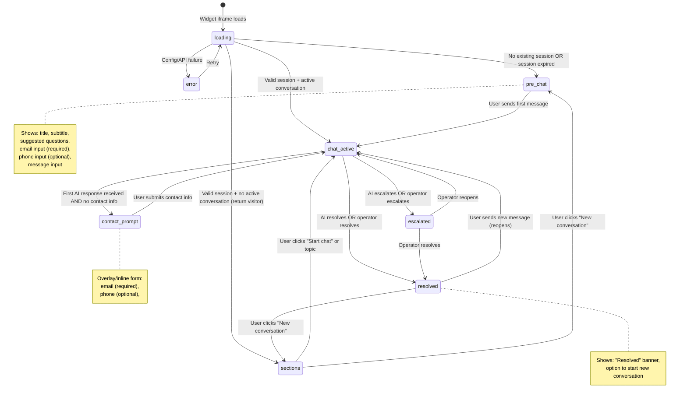
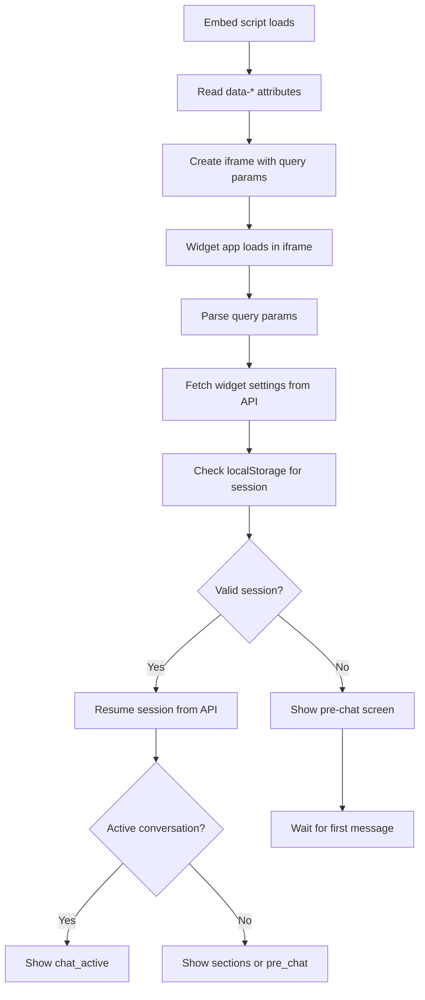

# 09 — Widget State Machine

## Overview

The widget follows a **conversation-first** flow: the customer can start chatting immediately without providing contact information. Contact capture happens after the first message. User is not allowed to send a second message without providing contact information.

---

## State Diagram



---

## State Definitions

### `loading`
- Widget iframe has loaded, reading query parameters from embed script
- Calls `GET /api/v1/widget/settings` to fetch agent config, branding, sections
- Checks localStorage for existing `contactSessionId` + `token`
- If valid session: calls `POST /api/v1/widget/sessions` with token to resume
- Transitions based on session validity and conversation state

### `pre_chat`
- First-time visitor OR expired session
- Shows:
  - Agent avatar + name (the widget refers only to the agent's identity, never
    the organization name)
  - Optional welcome message (from `widgetSettings.welcomeMessage` /
    `agent.welcomeMessage`) — no hard-coded "How can we help?" greeting
  - Suggested questions (from `agent.suggestedQuestions`)
  - Message input composer
- **No contact form here** — conversation-first. Email/phone capture is
  deferred to the `contact_prompt` overlay, which fires after the first
  AI reply. Showing inputs up-front taxes the user before they've gotten
  any value from the chat.
- On first message:
  1. Create new contact session: `POST /api/v1/widget/sessions`
  2. Save `{ contactSessionId, token }` to localStorage
  3. Create conversation: `POST /api/v1/widget/conversations`
  4. Connect Socket.io, join conversation room
  5. Transition → `chat_active`

### `chat_active`
- Active conversation thread view
- Shows message bubbles (customer, AI, operator, system)
- Auto-scrolls to latest message
- Composer: text input, emoji picker, file attachment button
  - The textarea auto-grows with content up to **3 lines** (~76px), then scrolls
    internally; it collapses back to one line after send.
  - Emoji picker uses **emoji-mart** (`@emoji-mart/react` + `@emoji-mart/data`),
    lazy-loaded (`next/dynamic`, data imported on first open) to keep it out of
    the widget's initial bundle. Selecting inserts the native emoji at the
    textarea caret. A click-away backdrop closes the popover.
- Typing indicators (AI processing, operator typing)
  - The "AI is typing" dots are transient UI state held locally in `WidgetRoot`
    (`aiTyping`), **not** a state-machine state. Set when a customer message is
    sent (unless the conversation is `escalated`/`resolved`), cleared when the
    next non-customer message lands at the tail of the transcript, with a 45s
    safety timeout so it never hangs if a socket event is missed.
- Real-time updates via Socket.io

### `contact_prompt`
- Triggered after first AI response if `contactSession.email` is null
- **Blocking overlay** (should block chat)
- Fields:
  - Email (required) — validated client-side
  - Phone (optional)
- On submit (button labelled **"Continue"**):
  1. Call `POST /api/v1/widget/sessions/:id/contact`
  2. Transition → `chat_active` (contact form disappears)
- **No skip** — there is no Skip button; the customer must provide an email or
  phone and press "Continue" (`ContactPromptScreen` has no skip affordance).
- **Important**: Chat remains visible but not functional while prompt is shown

### `sections`
- Return visitor with valid session but no active conversation
- Shows widget sections (quick links/topics configured by org)
- Each section can:
  - `link` → open URL in new tab
  - `start-chat` → transition to `pre_chat` or directly start conversation
  - `topic` → start conversation with pre-filled message (`section.topicPrompt`)
- "Start a new conversation" CTA at bottom
- **Entry surface, not a mid-conversation surface.** Sections are shown only
  before the first message is sent; once the visitor is chatting the widget never
  routes back to `sections` (a status change on a resolved conversation goes to
  `resolved` / the ResolvedScreen — see below — not to `sections`). The persistent
  in-conversation section shortcuts are the separate `SectionsBar` (spec 22), not
  this full screen.

### `resolved`
- Conversation has been resolved (by AI or operator)
- Shows:
  - "This conversation has been resolved" banner
  - Full conversation history (read-only)
  - "Start a new conversation" button → `sections` when the org has sections
    configured (`context.sections.length > 0`), otherwise `pre_chat`
- New messages after resolution initiates new conversation (No reopen resolved ones):
- A `CONVERSATION_STATUS_CHANGED` event marking the conversation resolved transitions
  to `resolved` (this screen), **never** back to `sections`.

### `escalated`
- Conversation has been escalated to a human operator
- UI is same as `chat_active` but with:
  - `EscalatedBanner`: shows the amber "Connecting you to a teammate — they'll
    join in a moment." until an operator message exists, then flips to the green
    "You're connected with a teammate." (driven by `operatorJoined` = any
    message with role `operator`). This prevents the banner from looking stuck.
  - Operator messages appear in thread with operator name/avatar
- Operator replies reach the widget live: `POST /messages` (role `operator`)
  emits `message:new` to the `contact:<sessionId>` room, which the widget's
  socket handler appends regardless of state.
- AI no longer auto-replies
- Customer can continue sending messages

### `error`
- Config/API failure during loading
- Shows friendly error message with retry button
- Logs error details to console (not to customer)

---

## localStorage Schema

All keys are prefixed with `csb_` to avoid collisions:

| Key | Type | Description | Lifetime |
|-----|------|-------------|----------|
| `csb_session_token` | `string` | Contact session token (UUID) | Until expiration (24h) |
| `csb_session_id` | `string` | Contact session ID (`_id`) | Until expiration |
| `csb_conversation_id` | `string` | Current active conversation ID | Until session expires |
| `csb_org_id` | `string` | Organization ID from embed | Permanent |
| `csb_agent_id` | `string` | Agent ID from embed | Permanent |
| `csb_website_id` | `string` | Website ID from embed | Permanent |
| `csb_contact_email` | `string` | Cached email from pre-chat form | Per session |

### Session Management

```typescript
// apps/widget/src/lib/session.ts

const SESSION_TTL_MS = 24 * 60 * 60 * 1000; // 24 hours

interface StoredSession {
  token: string;
  sessionId: string;
  conversationId?: string;
  expiresAt: number; // Unix timestamp
}

function getStoredSession(): StoredSession | null {
  const raw = localStorage.getItem('csb_session');
  if (!raw) return null;
  
  const session: StoredSession = JSON.parse(raw);
  
  // Check client-side expiration
  if (Date.now() > session.expiresAt) {
    clearSession();
    return null;
  }
  
  return session;
}

function saveSession(session: { token: string; sessionId: string; conversationId?: string }) {
  const stored: StoredSession = {
    ...session,
    expiresAt: Date.now() + SESSION_TTL_MS
  };
  localStorage.setItem('csb_session', JSON.stringify(stored));
}

function clearSession() {
  localStorage.removeItem('csb_session');
  localStorage.removeItem('csb_contact_prompted');
  localStorage.removeItem('csb_contact_dismissed');
}
```

---

## Session Expiration Behavior

| Scenario | Behavior |
|----------|----------|
| Token expired (24h) | Widget creates new session → customer starts fresh conversation |
| Token valid, conversation resolved | Show sections/pre_chat, can start new conversation |
| Token valid, conversation active | Resume conversation, show existing messages |
| localStorage cleared | Same as expired: new session |
| Different browser/device | New session (no cross-device continuity in v1) |

### Sliding vs Fixed Window

**Recommended: Sliding window**

```
On every customer message:
  session.expiresAt = now + 24h
  session.lastActiveAt = now
  Update both localStorage and API
```

This means an active conversation never times out mid-chat. Only 24h of **inactivity** triggers expiration.

---

## Widget Configuration Flow



### Query Parameters (iframe URL)

```
https://widget.example.com/?agentId=xxx&position=bottom-right&primaryColor=%23864ffe&theme=auto
```

The embed loader forwards **only** the agent id plus cosmetic hints. The
organization and website are derived server-side from the agent (one agent maps
to one website), so no org/website IDs are passed. The cosmetic params let the
widget render correctly on first paint; the authoritative settings (title,
welcome message, colour, position, theme, avatar, branding, contact gating)
arrive from `POST /widget/init` keyed by `agentId`.

| Param | Source (`data-*`) | Description |
|-------|-------------------|-------------|
| `agentId` | `data-agent` / `data-agent-id` | Agent ID — the only required identifier. |
| `position` | `data-position` | Launcher position hint (`bottom-right` \| `bottom-left` \| `centered`). |
| `primaryColor` | `data-primary-color` | Accent colour hint for the launcher. Default accent when none is configured is `#1e40af` (blue-800) — applied consistently across the widget root, boot screen, the server-side `/widget/settings` fallback, and the Widget Studio's first/default swatch. |
| `theme` | `data-theme` | Theme hint (`light` \| `dark` \| `auto`). |

#### Organization resolution (`agentId` vs `domain`)

`POST /widget/init` resolves the session's organization from **`agentId` when
provided**, else falls back to `domain`. Resolving by `agentId` ties the
session to that agent's org directly, so the widget uses that org's knowledge
base and conversations land in that org's inbox — independent of the embedding
page's hostname.

- The embed snippet forwards `agentId` (from `data-agent-id`); the dashboard
  **widget preview** appends the current org's `agentId` to the iframe URL.
- When resolving by `agentId`, the org's first active `Website` supplies the
  required `websiteId` for the session/conversation.
- The widget resumes a stored localStorage session only if its `agentId`
  matches the current one; otherwise it mints a fresh session (prevents a stale
  session from talking to the wrong org — e.g. when the preview switches orgs).

---

## Critical Rules

1. **Email is NEVER used to look up or merge conversations** — session token only
2. **Conversation starts before contact info** — always
3. **24-hour session expiration** — sliding window on activity
4. **localStorage is the truth** for widget state (validated against API on load)
5. **Socket.io reconnects transparently** — messages are never lost (saved via REST first, then emitted)
6. **Pre-chat screen disappears** once any message exists in the thread
